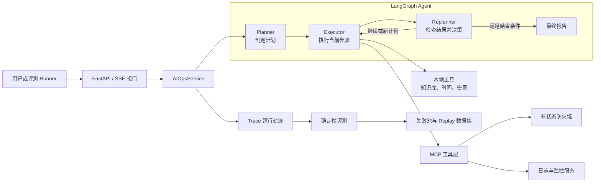

# Day 1：先看懂 FireDrill 到底在做什么

> 建议学习时间：2～3 小时  
> 今天的关键词：项目边界、请求链路、LangGraph、MCP、状态、SSE、Trace

## 今天学完要达到什么程度

今天不要急着研究每一段 Prompt，也不用背具体代码。先给自己建立一张完整的“项目地图”。

学完后，你应该可以做到：

- 用一句话说明 FireDrill 是什么；
- 用 1 分钟介绍项目背景、解决的问题和技术方案；
- 不看代码画出系统的整体架构；
- 说清一个用户任务从进入系统到返回结果经历了什么；
- 明确哪些是个人项目真实实现，哪些只是模拟环境，避免面试时说过头。

如果今天只能记住一句话，请记住：

> FireDrill 不是一个“让大模型直接改防火墙”的 Demo，而是一个让 Agent 按照“规划、执行、检查、再决策”的流程完成运维任务，并用系统真实终态判断它到底有没有成功的演练平台。

---

## 一、先理解项目为什么存在

### 1. 普通大模型为什么不适合直接做运维变更

假设用户说：

> 请放通 trust 区到 untrust 区的 TCP 465 端口，提交生效并验证。

这不是一个普通问答，而是一个包含多步操作的任务：

1. 查看安全区和当前规则；
2. 新增防火墙规则；
3. 检查候选配置差异；
4. 提交配置；
5. 验证流量是否真的放通；
6. 如果中间失败，还要决定重试、重新规划还是如实报告失败。

如果只让大模型回答一次，它很容易出现三个问题：

- **只说不做**：生成一段看起来正确的操作建议，但没有调用任何工具；
- **做到一半**：新增了规则，却忘记 Commit 或流量验证；
- **假完成**：工具失败了，最终报告仍然说“任务已完成”。

FireDrill 的核心，就是把这些不可靠的自由发挥约束成一个可观察、可评测的执行流程。

### 2. 为什么项目叫 FireDrill

`FireDrill` 可以理解为“消防演练”。真实生产防火墙不能随便让个人项目修改，所以项目构建了一个**有状态的防火墙演练环境**：

- 它有运行配置和候选配置；
- 支持新增、删除、Commit 和 Discard；
- 可以验证规则命中和流量结果；
- 可以模拟设备繁忙、提交失败、超时等故障；
- 评测程序还可以通过 Agent 看不到的带外接口检查最终状态。

因此，它验证的是生产 Agent 中最重要的控制链路，但不会真的修改生产设备。

---

## 二、用一句话和一分钟介绍项目

### 一句话版本

> FireDrill 是一个基于 LangGraph 和 MCP 的智能运维 Agent 演练平台，能够把防火墙变更或故障诊断任务拆成多步计划，调用工具执行，并通过提交与终态验证形成闭环。

### 一分钟版本

下面这段不用逐字背诵，但要理解每一句在说什么：

> 这个项目来源于我对生产级防火墙配置 Agent 核心链路的个人工程验证。运维变更不是一次问答，它通常需要查询现状、修改配置、提交、验证，并根据每一步结果动态调整。因此我使用 LangGraph 实现了 Planner、Executor、Replanner 状态机，通过 MCP 接入日志、监控和有状态防火墙工具。为了避免 Agent 在工具失败后提前宣布完成，我增加了变更完成守卫和最多 8 步的执行预算。同时，我用带外终态断言判断配置是否真的生效，并把失败 Trace 自动转成失败样本和回放数据，用于下一轮策略优化。

这段话包含五层信息：

1. **项目来源**：生产问题的个人开源复刻；
2. **问题特点**：运维任务是多步、有状态、有副作用的；
3. **Agent 架构**：Planner、Executor、Replanner；
4. **工具能力**：通过 MCP 操作外部系统；
5. **可靠性手段**：完成守卫、终态断言、失败回放。

---

## 三、先看懂整体架构图



可以把它想象成一个维修团队：

- **FastAPI** 是接待台，负责接收任务和持续反馈进度；
- **AIOpsService** 是项目经理，负责组织整条工作流；
- **Planner** 是方案工程师，先列出要做的步骤；
- **Executor** 是现场工程师，每次只执行当前步骤；
- **Replanner** 是复核人员，检查刚才的结果，再决定继续、改计划或结束；
- **MCP** 是统一工具箱，让 Agent 用标准方式操作不同系统；
- **Trace** 是全程录像；
- **Evaluator** 是验收人员，不听 Agent 自己说成功，而是检查系统最终状态。

### 为什么 Planner、Executor、Replanner 要分开

如果让一个模型同时思考所有步骤、调用所有工具并决定是否完成，它很容易混乱。拆开以后，每个节点职责更单一：

| 节点 | 只负责什么 | 不应该做什么 |
|---|---|---|
| Planner | 根据目标制定计划 | 不直接执行工具 |
| Executor | 执行当前步骤并记录真实结果 | 不凭空宣布整个任务完成 |
| Replanner | 根据计划和历史结果决定下一步 | 不跳过必要的提交和验证 |

这种设计的核心价值不是“用了三个英文名字”，而是让每一步都留下可检查的状态。

---

## 四、今天需要阅读的代码

今天按下面的顺序阅读。第一遍只看结构和注释，不要在不熟悉的库函数上停留太久。

### 第 1 份：`README.md`，15 分钟

文件：[README.md](../../README.md)

重点只看四个部分：

1. 项目简介；
2. 核心特性；
3. 技术栈；
4. 项目目录结构。

看完以后，在纸上写出下面这句话并补全：

> FireDrill 使用 ______ 作为 Web 服务，使用 ______ 编排 Agent，使用 ______ 统一接入工具，使用 ______ 保存向量知识。

参考答案：FastAPI、LangGraph、MCP、Milvus。

### 第 2 份：`app/main.py`，20 分钟

文件：[app/main.py](../../app/main.py)

只关注三件事：

#### 1. FastAPI 应用是怎么创建的

代码中的 `app = FastAPI(...)` 创建了主应用，后面的 `include_router` 把对话、文件、健康检查和 AIOps 接口挂载进来。

你可以把 Router 理解为商场的不同柜台：主应用负责提供场地，每个 Router 负责一种业务。

#### 2. 应用启动时做了什么

`lifespan` 会在启动时尝试连接 Milvus，关闭时释放连接。

值得注意的是：Milvus 连接失败不会让整个系统退出，而是让 RAG 知识库降级不可用。这样防火墙操作、监控查询等其他功能仍然可以工作。

这体现了一个常见的工程思想：

> 非核心依赖出现故障时，优先降级局部能力，而不是拖垮整个服务。

#### 3. API 路由有哪些

- `/api/chat`：普通对话；
- `/api/chat_stream`：流式对话；
- `/api/aiops`：Agent 运维诊断；
- `/api/upload`：上传知识库文档；
- `/health`：健康检查。

### 第 3 份：`app/api/aiops.py`，20 分钟

文件：[app/api/aiops.py](../../app/api/aiops.py)

这个文件是 HTTP 请求进入 Agent 的入口之一。

请求进入后，主要发生三件事：

1. 读取 `session_id`；
2. 调用 `aiops_service.diagnose()`；
3. 把 Agent 产生的事件转换成 SSE，持续发给前端。

#### SSE 是什么

普通 HTTP 请求通常是“请求一次，返回一次”。但 Agent 可能运行几十秒，用户需要看到：

- 正在制定计划；
- 第一步已完成；
- 正在重新规划；
- 最终报告已生成。

SSE 可以让服务端在同一个连接中不断向前端发送事件。这里可能出现的事件包括：

- `plan`：计划已生成；
- `step_complete`：一个步骤执行完成；
- `report`：最终报告；
- `complete`：整个任务结束；
- `error`：发生异常。

注意：当前 `/api/aiops` 的 `diagnose()` 使用固定的故障诊断任务；防火墙评测 Runner 则会直接调用 `execute(user_input)` 执行具体测试任务。两者最终走的是同一套 LangGraph 主流程。

### 第 4 份：`app/agent/aiops/state.py`，20 分钟

文件：[app/agent/aiops/state.py](../../app/agent/aiops/state.py)

Agent 的全部核心状态只有四项：

| 字段 | 通俗解释 | 示例 |
|---|---|---|
| `input` | 用户最终想完成什么 | 放通 TCP 465 并验证 |
| `plan` | 接下来还要做什么 | 新增规则、Commit、验证 |
| `past_steps` | 已经做了什么，以及真实结果 | 新增成功，返回 `rule-007` |
| `response` | 最终交付给用户的报告 | 配置已提交，流量验证通过 |

`past_steps` 使用 `operator.add`，意味着节点返回的新步骤会追加到历史，而不是覆盖以前的步骤。

这很重要，因为 Replanner 必须知道前面到底发生了什么。例如新增规则后工具返回真实 ID `rule-007`，后续步骤应该继续使用这个 ID，不能靠模型猜一个 ID。

### 第 5 份：`app/services/aiops_service.py`，40 分钟

文件：[app/services/aiops_service.py](../../app/services/aiops_service.py)

这是今天最重要的文件，但只看下面几个位置。

#### 1. `_build_graph()`：工作流如何连接

图中有三条固定关系：

```text
Planner → Executor → Replanner
                       ↓
              继续 Executor 或结束
```

入口一定是 Planner。Executor 每次执行一步，然后一定交给 Replanner 检查。Replanner 如果发现还有计划，就回到 Executor；如果已经生成最终响应，就结束。

#### 2. `execute()`：一次任务如何运行

`execute()` 做的主要工作可以压缩成六步：

1. 创建 Trace；
2. 清除同一会话可能残留的旧检查点；
3. 创建初始状态；
4. 让 LangGraph 流式运行；
5. 把不同节点的状态转换成前端事件；
6. 保存最终状态并结束 Trace。

初始状态非常简单：

```python
{
    "input": user_input,
    "plan": [],
    "past_steps": [],
    "response": "",
}
```

这表示刚开始时只有用户目标，还没有计划、执行历史和最终报告。

#### 3. 为什么执行前要清理旧检查点

LangGraph 的 `MemorySaver` 会按 `session_id` 保存状态。`past_steps` 又是追加式字段，如果重复使用同一个会话而不清理，上一轮的步骤可能混进新任务。

这会带来很隐蔽的问题：系统可能以为新任务已经执行了很多步，从而提前触发最大步数限制。

因此，代码在执行新任务前调用 `adelete_thread(session_id)` 清理旧状态。这是一个很好的面试细节：说明你关注的不只是 Agent Prompt，也关注工作流状态隔离。

#### 4. Trace 在哪里开始和结束

任务开始时调用 `begin_run()`，过程中记录图状态和模型、工具事件，结束时调用 `finish_run()`。

Trace 的作用不是单纯打印日志，而是为后面的失败分类、回放和回归门禁提供结构化数据。

---

## 五、完整走一遍请求链路

继续使用这个任务：

> 请放通 trust 区到 untrust 区的 TCP 465 端口，提交生效并验证。

### 第 1 步：请求进入系统

用户或评测 Runner 提交任务。API 层负责接收请求，但它不负责思考怎么配置防火墙。

### 第 2 步：AIOpsService 创建初始状态

此时只有 `input` 有内容，计划和历史都是空的，同时创建本次运行的 Trace。

### 第 3 步：Planner 制定计划

Planner 可能生成：

1. 查询当前安全区和规则；
2. 新增 TCP 465 放通规则；
3. 检查候选配置差异；
4. Commit；
5. 测试流量。

计划会写进 `plan`。

### 第 4 步：Executor 执行当前步骤

Executor 每次只取计划中的第一步，通过本地工具或 MCP 工具执行，然后把“步骤 + 真实结果”追加到 `past_steps`。

### 第 5 步：Replanner 检查

Replanner 会同时看到：

- 用户原始目标；
- 剩余计划；
- 已执行步骤；
- 工具真实返回结果。

它可以决定继续、调整计划，或者在满足完成条件后生成最终报告。

### 第 6 步：终态验证

Agent 说“成功”并不等于真的成功。评测 Runner 会通过带外接口检查：

- 目标规则是否存在；
- Running Revision 是否变化；
- 是否还有未提交的 Candidate Config；
- 流量验证结果是否符合预期。

只有硬断言全部通过，评测结果才是成功。

---

## 六、今天的动手任务

### 任务 1：自己画一遍架构图

不要照抄上面的图。关掉文档后，在纸上画出这些组件：

```text
用户、FastAPI、AIOpsService、Planner、Executor、Replanner、
本地工具、MCP、防火墙、Trace、Evaluator
```

然后用箭头连接它们，并给每个箭头写一句话。

### 任务 2：在代码中找到主链路

在项目根目录执行：

```bash
rg -n "include_router|StateGraph|add_node|add_edge|execute\(|begin_run|finish_run" app
```

看到搜索结果后，不要求全部看懂，只要能指出：

- HTTP 路由在哪里注册；
- LangGraph 在哪里创建；
- 三个节点在哪里加入图；
- Trace 在哪里开始和结束。

### 任务 3：用自己的话讲 1 分钟

打开手机录音，不看文档讲一遍项目。讲完后检查是否包含：

- 为什么做；
- 怎么做；
- 为什么不能只靠模型自报成功；
- 项目如何验证结果。

如果超过 90 秒，删除不必要的技术名词再讲一遍。

---

## 七、Day 1 自测题

建议先自己回答，再看参考答案。

### 1. FireDrill 本质上解决的是什么问题？

参考答案：解决大模型在多步骤、有状态、有副作用的运维任务中容易漏步骤、错误调用工具和提前宣布完成的问题，通过状态机编排、真实工具执行和终态评测提高可控性。

### 2. FastAPI 和 LangGraph 分别负责什么？

参考答案：FastAPI 负责对外提供 HTTP/SSE 接口；LangGraph 负责 Agent 内部节点、状态和流转逻辑。

### 3. 为什么需要 Replanner？

参考答案：运维任务不能假设每一步都会成功。Replanner 根据实际执行结果决定继续、调整计划或结束，让计划可以动态变化。

### 4. MCP 的价值是什么？

参考答案：MCP 给模型提供统一的工具发现和调用方式，使日志、监控、防火墙等不同服务可以用相对一致的协议接入 Agent。

### 5. 为什么不能根据最终报告判断任务成功？

参考答案：报告由模型生成，可能与系统真实状态不一致。防火墙变更应检查规则、配置版本、候选配置和流量结果等确定性证据。

### 6. `past_steps` 为什么不能每次覆盖？

参考答案：Replanner 和后续 Executor 需要看到完整执行历史以及工具返回的真实数据，才能正确继续任务和复用实际规则 ID。

### 7. Milvus 挂了为什么系统还能执行防火墙任务？

参考答案：Milvus 只支撑 RAG 知识库。系统对它做了能力降级，知识检索不可用，但 Agent 主流程和其他工具仍可继续工作。

---

## 八、面试时要守住的项目边界

下面三句话要说准确：

### 可以说

> 项目源于生产级防火墙配置 Agent 的核心链路，我用开源技术栈做了独立工程验证。

> 我实现了有状态防火墙模拟服务，可以验证候选配置、提交、回滚、流量测试和故障注入。

> 评测结果来自固定用例、重复运行和终态硬断言。

### 不要说

> 这个个人项目已经直接控制生产防火墙。

> 第二轮 6/6 说明整个 Agent 平台成功率是 100%。

> RAG 的 36 条小样本实验证明查询改写在所有场景都有效。

准确描述实验边界不会削弱项目，反而会让面试官觉得你真正理解评测。

---

## 九、今天的完成清单

完成一项打一个勾：

- [ ] 阅读 README 的项目介绍、技术栈和目录结构；
- [ ] 阅读 `app/main.py`，知道服务如何启动和注册路由；
- [ ] 阅读 `app/api/aiops.py`，理解 SSE 的作用；
- [ ] 阅读 `state.py`，能解释四个状态字段；
- [ ] 阅读 `aiops_service.py` 的 `_build_graph()` 和 `execute()`；
- [ ] 独立画出一张架构图；
- [ ] 用自己的话完成一次 1 分钟项目介绍；
- [ ] 不看答案回答 7 道自测题。

完成以上内容后，Day 1 就结束。今天不要继续深挖 Planner、Executor 和 Replanner 的 Prompt，它们是 Day 2 的内容。

---

## 十、学习笔记模板

可以把下面内容复制到自己的笔记里：

```text
今天我理解的 FireDrill：

它要解决的问题：

一次任务的主链路：

Planner 的职责：

Executor 的职责：

Replanner 的职责：

为什么需要 MCP：

为什么需要终态断言：

我目前还没理解的问题：
```
