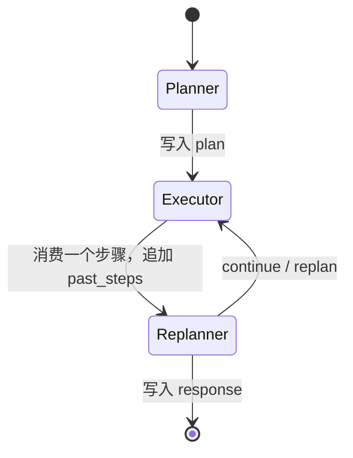
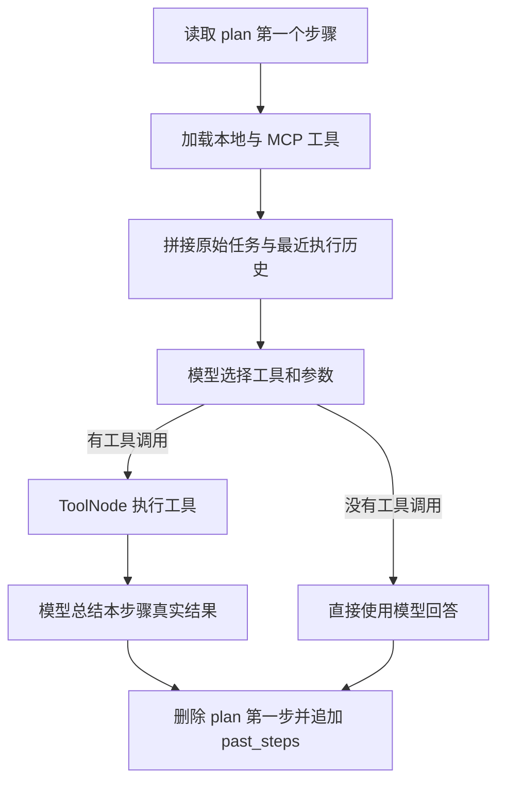

# Day 2：吃透 Planner → Executor → Replanner 状态机

> 建议学习时间：2～3 小时  
> 前置内容：[Day 1：项目全局认知](./Day01-项目全局认知.md)  
> 今天的关键词：State、节点、边、结构化输出、状态更新、完成守卫、执行预算

## 今天学完要达到什么程度

Day 1 解决的是“这个项目整体在做什么”，Day 2 解决的是“Agent 内部到底怎么运转”。

学完后，你应该能够：

- 不看代码画出 LangGraph 的节点和边；
- 解释 `input`、`plan`、`past_steps`、`response` 如何变化；
- 说清 Planner、Executor、Replanner 各自的输入、动作和输出；
- 解释 `continue`、`replan`、`respond` 三种决策；
- 解释为什么要限制 8 步，以及为什么 5 步后限制重新规划；
- 沿着真实 Trace 复盘一次完整任务；
- 面对“这不就是一个循环吗”的追问，说明使用 LangGraph 的实际价值。

今天最重要的一句话是：

> LangGraph 节点不是互相直接传参数，而是共同读取和更新一份状态；图上的边决定更新状态后，下一个节点是谁。

---

## 一、先把 LangGraph 想象成“带档案袋的流水线”

可以把一次 Agent 任务想象成一个档案袋在三个岗位之间流转。

档案袋里装着：

```text
用户要做什么
接下来还要做什么
已经做过什么
最终要回复什么
```

Planner 拿到档案袋后，把计划放进去；Executor 每次取出一个步骤执行，再把真实结果放进去；Replanner 查看全部材料，决定继续、换计划或结案。

三个节点不会靠“记忆”记住上一轮发生了什么，它们依赖的是统一状态 `PlanExecuteState`。



在当前项目里，图的固定路径是：

```text
Planner → Executor → Replanner
              ↑           │
              └───────────┘
```

这里有一个容易忽略的点：

> Executor 不能直接连续执行第二步。每执行一步，都必须先经过 Replanner 复核。

这让系统有机会根据工具真实结果改变后续行为。

---

## 二、先吃透 State：四个字段就是 Agent 的“共享记忆”

今天第一份代码是：[app/agent/aiops/state.py](../../app/agent/aiops/state.py)

核心状态如下：

```python
class PlanExecuteState(TypedDict):
    input: str
    plan: list[str]
    past_steps: Annotated[list[tuple], operator.add]
    response: str
```

### 1. `input`：始终不变的原始目标

例如：

```text
请删除 allow-dns 规则（rule-003），提交生效。
```

后面的计划可能改变，步骤也可能失败，但原始目标不能丢。Replanner 判断“到底做完没有”时，必须回到这个目标。

### 2. `plan`：尚未执行的步骤队列

Planner 刚完成时，`plan` 可能是：

```python
[
    "删除 rule-003",
    "检查候选配置差异",
    "提交配置",
]
```

Executor 每次只拿 `plan[0]`，执行后返回 `plan[1:]`。因此 `plan` 会越来越短。

### 3. `past_steps`：已经执行的步骤和真实结果

每条历史都是一个二元组：

```python
(
    "删除 rule-003",
    "删除成功，候选配置中已不存在 rule-003",
)
```

它使用了：

```python
Annotated[list[tuple], operator.add]
```

意思是新值与旧值相加，也就是**追加**，不是覆盖。

假设当前历史为：

```python
[("查询规则", "找到 rule-003")]
```

Executor 返回：

```python
{"past_steps": [("删除规则", "删除成功")]}
```

LangGraph 合并后会得到：

```python
[
    ("查询规则", "找到 rule-003"),
    ("删除规则", "删除成功"),
]
```

### 4. `response`：最终响应，也是结束信号

一开始 `response` 是空字符串。Replanner 判断任务可以结束后，生成最终报告并返回：

```python
{"response": "# 执行结果\n规则已删除并提交生效……"}
```

`AIOpsService.should_continue()` 发现 `response` 非空，就把流程送到 `END`。

### 状态更新最关键的区别

| 字段 | 更新方式 | 原因 |
|---|---|---|
| `input` | 通常不更新 | 原始目标要保持不变 |
| `plan` | 新值覆盖旧值 | 剩余计划会被消费或替换 |
| `past_steps` | 追加 | 历史证据不能丢 |
| `response` | 生成时覆盖 | 最终只需要一个完整报告 |

面试时如果能主动讲出“`plan` 覆盖、`past_steps` 追加”，说明你确实读过状态机，而不是只记住了三个节点名称。

---

## 三、图是怎么创建出来的

阅读：[app/services/aiops_service.py](../../app/services/aiops_service.py)

找到 `_build_graph()`，按下面五步理解。

### 第 1 步：声明状态类型

```python
workflow = StateGraph(PlanExecuteState)
```

这相当于告诉 LangGraph：以后所有节点共享的数据都应该符合 `PlanExecuteState`。

### 第 2 步：注册三个节点

```python
workflow.add_node("planner", planner)
workflow.add_node("executor", executor)
workflow.add_node("replanner", replanner)
```

这里的节点本质上都是异步函数：读取 `state`，返回需要更新的字段。

### 第 3 步：设置入口

```python
workflow.set_entry_point("planner")
```

所有任务都先规划，再执行。

### 第 4 步：连接固定边

```python
workflow.add_edge("planner", "executor")
workflow.add_edge("executor", "replanner")
```

无论 Planner 生成什么计划，下一站都是 Executor；无论 Executor 成功还是失败，下一站都是 Replanner。

### 第 5 步：给 Replanner 添加条件边

Replanner 后面不是固定节点，而是根据当前状态选择：

```text
response 非空 → END
response 为空且 plan 非空 → Executor
response 为空且 plan 为空 → END
```

正常情况下，计划为空时 Replanner 会先生成 `response`，然后条件边结束流程。

### 为什么需要 Checkpointer

图在编译时使用了 `MemorySaver`：

```python
workflow.compile(checkpointer=self.checkpointer)
```

它会按照 `thread_id` 保存状态快照，让同一任务的多次节点流转可以共享状态。

当前实现每次执行新任务前都会清理同一 `session_id` 的旧检查点。这是因为 `past_steps` 是追加字段，如果不清理，上一轮历史可能污染下一轮任务。

---

## 四、Planner：先规划，但不执行防火墙操作

阅读：[app/agent/aiops/planner.py](../../app/agent/aiops/planner.py)

Planner 的目标是把模糊任务变成一组具体步骤。

### Planner 的输入

主要读取：

```python
input_text = state.get("input", "")
```

第一次进入 Planner 时，`plan` 和 `past_steps` 都还是空的。

### Planner 做了哪四件事


#### 1. 查询经验文档

Planner 会先调用 `retrieve_knowledge`，尝试找到相关运维经验。

这里要准确表达：Planner 不执行防火墙、Commit 等业务操作，但它会做**规划前的知识检索和工具清单加载**。

如果 Milvus 不可用，知识检索失败会被捕获，Planner 仍可以继续生成计划。

#### 2. 获取工具清单

它会合并：

- 本地工具；
- MCP 工具。

然后把工具名称与描述整理成文本，让模型知道后续 Executor 可以使用什么能力。

#### 3. 使用结构化输出生成计划

Planner 不是让模型随便输出一段文字，而是要求返回：

```python
class Plan(BaseModel):
    steps: list[str]
```

这叫结构化输出。它的价值是让程序可以稳定读取 `steps`，不用从自然语言里猜哪些内容是计划。

#### 4. 返回状态增量

成功时只返回：

```python
{"plan": plan_steps}
```

它不会重新返回 `input`，因为 `input` 已经存在于共享状态中。

### Planner Prompt 中最值得掌握的约束

- 普通配置变更控制在 4～6 步；
- 每一步尽量说明使用什么工具和参数；
- 工具层已经处理明确的临时错误，不要把每一次重试写成计划步骤；
- 用户给出 `rule-003` 时，后续计划原样携带；
- 只有规则名称时，先查询真实 ID；
- 新规则 ID 必须使用新增工具返回值，不能预先猜测。

这些规则来自真实失败样本，不是为了把 Prompt 写得“看起来专业”。例如历史回放中，模型曾把规则名 `allow-dns` 当作 `rule_id`，导致删除失败。

### Planner 失败会发生什么

如果模型连续返回空计划，或规划过程抛出异常，外层异常处理会返回一个通用兜底计划：

```python
["收集相关信息", "分析数据", "生成报告"]
```

这个兜底能避免整条图立刻崩溃，但对于防火墙变更不一定足够准确。这是当前实现可以继续优化的地方，面试时可以主动说明。

---

## 五、Executor：一次只执行一个步骤

阅读：[app/agent/aiops/executor.py](../../app/agent/aiops/executor.py)

Executor 的核心原则是：

> 只执行 `plan[0]`，不要擅自把后面所有步骤一起做完。

### Executor 的完整流程



### 第 1 步：取出当前任务

```python
task = plan[0]
```

假设计划是：

```python
["删除规则", "检查差异", "提交配置"]
```

本轮 Executor 只负责“删除规则”。

### 第 2 步：给模型绑定工具

```python
llm_with_tools = llm.bind_tools(all_tools)
```

绑定后，模型不只是生成文字，还可以返回结构化工具调用，例如：

```json
{
  "name": "delete_firewall_rule",
  "args": {"rule_id": "rule-003"}
}
```

### 第 3 步：补充执行上下文

Executor 不只看到当前步骤，还会通过 `format_execution_context()` 获得：

- 原始用户任务；
- 最近 3 个已执行步骤；
- 每个步骤最多 1200 字符的真实结果。

阅读：[app/agent/aiops/utils.py](../../app/agent/aiops/utils.py)

这样做是为了保留真实标识符。例如 `add_firewall_rule` 返回 `rule-007` 后，后续步骤可以从历史中拿到它，而不是让模型猜 ID。

为什么只保留最近 3 步并截断结果？因为上下文无限增长会增加 Token 成本，也会让模型被无关历史干扰。

### 第 4 步：模型选择工具

第一次模型调用的目的叫 `select_tools`。模型根据当前步骤决定：

- 是否需要工具；
- 调用哪个工具；
- 参数是什么。

### 第 5 步：ToolNode 执行工具

如果模型返回了工具调用，`ToolNode` 会根据工具名找到对应实现并执行。

Executor 会把工具请求与工具结果记录进 Trace，但真正的成功与否仍然要看工具返回内容和最终系统状态。

### 第 6 步：模型总结本步骤

工具通常返回 JSON 或较底层的文本。Executor 把结果交给模型，生成便于 Replanner 理解的步骤总结。

### 第 7 步：更新状态

Executor 返回：

```python
{
    "plan": plan[1:],
    "past_steps": [(task, result)],
}
```

这里同时发生两件事：

- `plan` 覆盖成剩余步骤；
- `past_steps` 追加本轮结果。

### Executor 出错时为什么还要记录历史

如果本步骤抛出异常，Executor 不会让整个图直接崩溃，而是返回：

```python
{
    "plan": plan[1:],
    "past_steps": [(task, "执行失败: ...")],
}
```

也就是说：当前步骤仍被消费，但失败证据被放进历史，随后交给 Replanner 决定是否重新安排这一步。

这样设计的好处是失败可见、流程可继续；代价是 Replanner 必须能够识别失败并补回必要步骤，否则任务可能遗漏动作。

---

## 六、模型重试为什么不能包住整个 Executor

阅读：[app/agent/aiops/model_retry.py](../../app/agent/aiops/model_retry.py)

Executor 的两次模型调用使用 `invoke_model_with_retry()`：

- `select_tools`：选择工具；
- `summarize_step`：总结工具结果。

它只重试明确的瞬时错误，例如：

- Timeout；
- Connection reset；
- 429、502、503、504；
- 明确的暂时不可用或限流。

非法参数等永久错误不会重试。

最重要的是，重试范围只包围模型调用：

```text
模型选择工具 → 工具执行 → 模型总结
   可重试        不随模型重试       可重试
```

假如把整个 Executor 包起来，可能出现这种情况：

1. Commit 已经成功；
2. 后面的模型总结超时；
3. 整个 Executor 重跑；
4. Commit 被执行第二次。

这就是有副作用工具的“重复执行”风险。安全重试必须明确划分副作用边界。

Day 3 会继续深入 MCP 工具自身的重试和幂等语义，今天先理解这个边界。

---

## 七、Replanner：不是重新写计划，而是负责下一步决策

阅读：[app/agent/aiops/replanner.py](../../app/agent/aiops/replanner.py)

Replanner 每次都能看到：

- `input`：原始任务；
- `plan`：剩余步骤；
- `past_steps`：已经执行的步骤和结果。

它通过结构化输出返回：

```python
class Act(BaseModel):
    action: str
    new_steps: list[str]
```

### 三种决策

| 决策 | 含义 | 状态如何变化 |
|---|---|---|
| `continue` | 当前剩余计划合理 | 返回 `{}`，保留当前 `plan` |
| `replan` | 当前计划有明显错误或缺漏 | 返回新的 `plan`，覆盖旧计划 |
| `respond` | 任务已完成或必须结束 | 写入 `response` |

### 为什么 `continue` 返回空字典

很多人第一次看会疑惑：

```python
return {}
```

是不是表示什么都不做？

准确说，它表示“不修改当前状态”。原来的 `plan` 仍然存在。随后条件边看到 `plan` 非空，就再次进入 Executor。

### 什么情况下需要 `replan`

例如：

```text
原计划：直接删除 allow-dns
实际结果：工具要求 rule_id，但当前只有规则名称
```

Replanner 应该生成新计划：

```text
1. 调用 list_firewall_rules 查询真实 ID
2. 使用真实 ID 删除规则
3. 检查差异
4. Commit
```

`replan` 不是每次都执行。当前 Prompt 把它放在最低优先级，只有原计划严重错误或遗漏关键步骤时才使用。

### 什么情况下可以 `respond`

查询类任务：已经获得回答所需信息。

变更类任务：至少需要确认目标动作已经执行、配置已经提交、必要验证已经完成。

仅仅“计划里有 Commit”不等于 Commit 已完成；必须查看 `past_steps` 中的真实结果。

---

## 八、完成守卫和执行预算

这是项目简历中最重要的可靠性设计之一。

### 1. 完成守卫解决什么问题

旧版 Replanner 更强调“信息够了就回复”。对于知识问答没有太大问题，但对于变更任务会造成提前结束：

```text
新增规则成功
    ↓
模型认为信息已经足够
    ↓
跳过 Commit 和验证
    ↓
报告声称完成，但配置没有真正生效
```

新版 Prompt 把判断原则改成：

```text
先看原始目标是否真实完成
再看剩余计划是否仍承载必要动作
最后才决定是否响应
```

对于变更任务，口诀是：

> 未提交、未验证，就不算完成。

### 2. 守卫目前属于哪一层

要准确理解当前实现：完成守卫主要写在 Replanner 的 Prompt 和决策提示中，它约束模型如何判断；最终评测使用确定性终态断言检查结果。

它不是一个完全由 Python 规则实现的通用状态机证明。因此模型仍可能判断错误，这也是为什么项目还需要评测与回放。

面试中主动说出这个边界会更加可信：

> 我先用 Prompt 守卫降低提前完成，再用 Agent 不可见的终态断言兜底验收；后续可以把关键变更状态进一步显式建模，把更多守卫下沉为确定性代码。

### 3. 为什么最大执行步数是 8

如果 Replanner 不断重新规划，图可能长时间循环：

```text
执行失败 → 重规划 → 再失败 → 再重规划 → ……
```

当前代码设置：

```python
MAX_STEPS = 8
```

当 `past_steps` 达到 8 时，Python 代码会强制生成最终响应。即使任务没有成功，也必须如实结束，而不是无限消耗模型调用。

### 4. 为什么执行 5 步后限制 Replan

当模型请求 `replan` 且已执行步骤达到 5 时，代码会拒绝再次重规划并生成响应。

此外，Prompt 也会提醒模型在步骤过多时尽快响应。

要区分两个限制：

| 限制 | 实现方式 | 作用 |
|---|---|---|
| 8 步强制结束 | Python 硬限制 | 防止无限循环 |
| 5 步后禁止新的 Replan | Python 分支 + Prompt | 防止计划持续膨胀 |

如果在 5 步以内重新规划，新计划长度也不能超过剩余预算：

```python
step_cap = MAX_STEPS - len(past_steps)
```

---

## 九、用状态快照走一遍完整任务

任务：

```text
删除 allow-dns 规则（rule-003），提交生效。
```

### 初始状态

```python
{
    "input": "删除 allow-dns 规则（rule-003），提交生效。",
    "plan": [],
    "past_steps": [],
    "response": "",
}
```

### Planner 完成后

```python
{
    "input": "删除 allow-dns 规则（rule-003），提交生效。",
    "plan": [
        "删除 rule-003",
        "检查候选配置差异",
        "提交配置",
    ],
    "past_steps": [],
    "response": "",
}
```

### 第一次 Executor 后

```python
{
    "plan": [
        "检查候选配置差异",
        "提交配置",
    ],
    "past_steps": [
        ("删除 rule-003", "删除成功"),
    ],
}
```

### 第一次 Replanner

剩余计划中还有“检查差异”和“提交”，任务尚未完成，因此返回 `continue`，也就是 `{}`。

### 第二次 Executor 后

```python
{
    "plan": ["提交配置"],
    "past_steps": [
        ("删除 rule-003", "删除成功"),
        ("检查候选配置差异", "rule-003 已从候选配置移除"),
    ],
}
```

### 第二次 Replanner

Commit 仍未执行，不能 `respond`，继续 Executor。

### 第三次 Executor 后

```python
{
    "plan": [],
    "past_steps": [
        ("删除 rule-003", "删除成功"),
        ("检查候选配置差异", "规则已移除"),
        ("提交配置", "提交成功，running revision=2"),
    ],
}
```

### 最后一次 Replanner

计划已经为空，Replanner 根据完整执行历史生成最终 `response`。条件边发现 `response` 非空，流程进入 `END`。

---

## 十、真实 Trace 是怎么看的

项目已经保留了一组真实回放轨迹。先找出一条成功运行的 Trace：

```bash
jq -r 'select(.passed == true) | .trace_path' \
  evals/results/flywheel-resilience-v2.jsonl | head -n 1
```

然后打印与状态机有关的关键事件：

```bash
trace_path=$(jq -r 'select(.passed == true) | .trace_path' \
  evals/results/flywheel-resilience-v2.jsonl | head -n 1)

jq -r '
  .events[]
  | select(
      .event_type == "node_started"
      or .event_type == "node_completed"
      or .event_type == "replanner_decision"
      or .event_type == "graph_state_updated"
    )
  | [
      .sequence,
      .event_type,
      (.node // "-"),
      ((.data.action // .data.step // .data.remaining_steps // "") | tostring)
    ]
  | @tsv
' "$trace_path"
```

观察下面的规律：

```text
planner started
planner completed
executor started
executor completed
replanner decision: continue
executor started
...
replanner decision: respond
```

再观察每次 `graph_state_updated` 中的 `remaining_steps` 是否逐步减少。

如果只读 Prompt 而不看一次真实 Trace，很容易对状态机的理解停留在纸面。今天一定要完成这一步。

---

## 十一、LangGraph 和普通 while 循环有什么区别

面试官很可能问：

> 这不就是 Planner、Executor、Replanner 套了一个 while 循环吗？为什么要 LangGraph？

不要回答“因为 LangGraph 比较流行”。可以从下面四点回答：

### 1. 显式状态

所有节点围绕统一 Schema 更新状态，比函数之间随意传递字典更容易约束和观察。

### 2. 显式路由

节点、固定边和条件边都被声明在图中，流程结构比嵌套的 `if/while` 更直观。

### 3. Checkpoint

可以按 `thread_id` 保存状态，支持流式执行、恢复和调试。当前项目使用内存 Checkpointer，并主动处理了会话状态污染问题。

### 4. 可观测性和扩展性

每个节点天然形成边界，便于记录开始、结束、状态更新和错误。未来也容易增加审批节点、回滚节点或人工确认节点。

同时也要承认：

> 如果流程只有一两个固定步骤，普通函数或循环更简单；这个项目选择 LangGraph，是因为任务具有动态计划、工具调用、重规划、状态持久化和多次循环。

---

## 十二、今天的动手任务

### 任务 1：手算状态变化

自己设计一个四步计划，在纸上写出：

1. 初始 State；
2. Planner 返回值；
3. 每次 Executor 返回值；
4. LangGraph 合并后的完整 State；
5. Replanner 每轮应该选择什么。

重点检查 `past_steps` 是否在追加，而不是只剩最后一条。

### 任务 2：找出五类状态返回

在三个节点文件中分别找到：

- Planner 成功时返回什么；
- Planner 失败时返回什么；
- Executor 成功时返回什么；
- Replanner `continue` 时返回什么；
- Replanner `respond` 时返回什么。

建议执行：

```bash
rg -n 'return \{|fallback_plan|_generate_response|action ==' \
  app/agent/aiops/planner.py \
  app/agent/aiops/executor.py \
  app/agent/aiops/replanner.py
```

### 任务 3：观察一条真实 Trace

使用上一节的命令，回答：

- Planner 一共运行几次？
- Executor 一共运行几次？
- 每一次 Replanner 做了什么决定？
- Commit 工具出现在哪个 Executor 步骤？
- 最终是什么事件结束运行？

### 任务 4：运行相关单元测试

```bash
PYTHONPATH=. .venv/bin/pytest -q \
  tests/test_model_retry.py \
  tests/test_observability.py
```

今天不要求理解所有测试实现，但要观察测试名称和通过结果，知道模型重试和 Trace 指标不是只写在文档里的设计。

---

## 十三、Day 2 自测题

先自己回答，再看参考答案。

### 1. 一个 LangGraph 节点接收什么、返回什么？

参考答案：接收当前共享 State，返回需要更新的状态字段。返回的不是完整状态也可以，LangGraph 会按字段规则合并。

### 2. 为什么 `past_steps` 使用 `operator.add`？

参考答案：让每次 Executor 返回的新步骤追加到完整历史中，Replanner 才能看到此前所有真实结果。

### 3. Executor 为什么只执行 `plan[0]`？

参考答案：每执行一步都让 Replanner 根据真实结果复核，避免一次性执行整份旧计划而无法处理中途变化。

### 4. Replanner 返回 `{}` 时发生什么？

参考答案：当前状态保持不变。因为原 `plan` 仍非空，条件边会把流程重新送到 Executor。

### 5. `replan` 返回的新计划是追加还是替换？

参考答案：替换当前剩余 `plan`。`plan` 没有追加 Reducer。

### 6. Executor 执行失败后为什么不直接结束？

参考答案：它把失败写入 `past_steps` 并交给 Replanner，后者可以重新规划、继续其他必要步骤或如实结束。

### 7. 为什么模型重试不能覆盖整个 Executor？

参考答案：Executor 中间可能执行 Commit 等有副作用工具。整个节点重试可能重复操作，因此只重试副作用之外的模型调用。

### 8. 8 步限制和 5 步限制有什么区别？

参考答案：8 步是 Python 层强制结束上限；执行达到 5 步后，如果模型还请求 replan，代码会禁止继续扩展计划并转为生成响应，Prompt 也会推动尽快收敛。

### 9. 完成守卫是不是完全确定性的？

参考答案：不是。当前完成守卫主要约束 Replanner Prompt；真正确定性的验收在 Agent 外部，由评测 Runner 检查防火墙终态。

### 10. Planner 真的完全不调用任何工具吗？

参考答案：它不执行防火墙变更等业务工具，但会直接做规划前的知识检索，并加载工具清单作为规划上下文。

---

## 十四、面试表达模板

### 30 秒说明状态机

> 我把 Agent 拆成 Planner、Executor 和 Replanner 三个节点，共享 input、plan、past_steps、response 四类状态。Planner 只生成结构化计划；Executor 每次消费一个步骤，调用工具并把真实结果追加到执行历史；Replanner 在每一步后根据原始目标、剩余计划和实际结果决定继续、替换计划或生成响应。最终 response 是图的结束信号。

### 说明完成守卫

> 原来的 Replanner 偏向“信息足够就结束”，在变更任务中容易新增规则后跳过 Commit 和验证。我在 Replanner 中增加了任务完成约束，要求基于已执行结果确认下发、提交、验证，而不是看计划里是否写过这些动作。同时用最多 8 步的硬预算防止死循环，并用 Agent 不可见的终态断言做最终验收。

### 说明当前局限

> 当前完成守卫仍主要位于 Prompt 决策层，不是所有变更状态都已经结构化。后续可以把 candidate_changed、committed、verified 等状态显式加入 State，再通过确定性条件边约束流程，进一步减少对模型判断的依赖。

---

## 十五、今天的完成清单

- [ ] 能解释四个 State 字段；
- [ ] 能说明 `plan` 覆盖与 `past_steps` 追加的区别；
- [ ] 能画出 Planner → Executor → Replanner → Executor/END；
- [ ] 阅读 Planner 的输入、结构化输出和兜底计划；
- [ ] 阅读 Executor 的工具选择、ToolNode 执行和状态更新；
- [ ] 阅读 Replanner 的三种决策；
- [ ] 能区分完成守卫、5 步限制和 8 步限制；
- [ ] 至少查看一条真实 Trace；
- [ ] 不看答案完成 10 道自测题；
- [ ] 用 30 秒讲清状态机设计。

完成这些内容后，Day 2 就结束。Day 3 再深入 MCP：工具如何发现、调用、分类错误，以及为什么不同工具需要不同的重试策略。

---

## 十六、学习笔记模板

```text
PlanExecuteState 的四个字段：

Planner 的输入、处理、输出：

Executor 的输入、处理、输出：

Replanner 的 continue：

Replanner 的 replan：

Replanner 的 respond：

plan 和 past_steps 的更新差异：

完成守卫解决的问题：

5 步限制和 8 步限制：

为什么模型重试不能包住整个 Executor：

我还没理解的问题：
```
