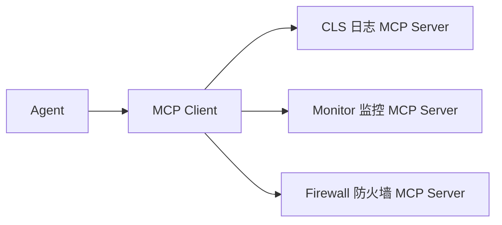
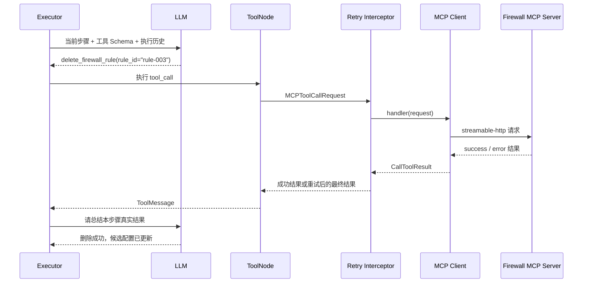

# Day 3：掌握 MCP 工具调用与安全重试

> 建议学习时间：2～3 小时  
> 前置内容：[Day 2：吃透 LangGraph 状态机](./Day02-吃透LangGraph状态机.md)  
> 今天的关键词：Tool、MCP Server、工具发现、Transport、Interceptor、错误分类、幂等性、副作用边界

## 今天学完要达到什么程度

Day 2 讲清了 Agent 如何流转，Day 3 要回答一个更具体的问题：

> Executor 决定调用工具以后，这个调用到底是怎样到达日志、监控或防火墙服务的？失败以后又为什么有时重试、有时不能重试？

学完后，你应该能够：

- 用通俗语言解释 MCP 是什么，以及项目为什么使用它；
- 区分本地 Tool、MCP Tool 和评测管理接口；
- 画出一次 MCP 工具调用的完整链路；
- 解释三个 MCP Server 分别提供什么能力；
- 区分应用错误、协议错误和传输异常；
- 判断临时错误、永久错误、状态未知错误是否应该重试；
- 解释为什么查询工具可以重试，而 Commit 等变更工具必须谨慎；
- 看懂一段真实 MCP 重试 Trace；
- 说出当前错误分类方案的局限和生产化改进方向。

今天最重要的一句话是：

> 重试不是“失败了再来一次”这么简单；对于有副作用的运维工具，必须先判断上一次操作到底有没有生效。

---

## 一、MCP 到底是什么

先不背协议定义，可以把 MCP 理解成 Agent 的“通用工具插座”。

没有 MCP 时，每接一个系统都可能要写一套不同的适配代码：

```text
Agent → 腾讯云日志 SDK
Agent → Prometheus HTTP API
Agent → 防火墙厂商 SDK
Agent → 数据库驱动
```

有了 MCP 后，外部服务把能力声明成一组标准工具：

```text
工具名称
工具说明
参数 Schema
调用结果
```

Agent 侧只需要通过 MCP Client 发现这些工具，再把它们绑定给模型。



### MCP 解决了什么问题

#### 1. 工具描述标准化

每个工具都有名称、用途、参数和返回值，模型可以根据 Schema 生成调用参数。

#### 2. 工具与 Agent 解耦

日志查询、防火墙操作等能力放在独立服务中，Agent 不需要把所有外部系统代码写进自身进程。

#### 3. 支持动态发现

Client 可以从多个 MCP Server 获取当前工具，而不是在 Executor 里手写全部工具定义。

#### 4. 便于治理调用链

工具真正执行前可以经过 Interceptor，统一记录 Trace、分类错误和控制重试。

### MCP 没有自动解决什么

MCP 只是工具协议和连接方式，并不会自动保证：

- 参数一定正确；
- 工具一定安全；
- Commit 一定幂等；
- 模型一定选对工具；
- 失败以后一定应该重试；
- Agent 最终报告一定符合系统真实状态。

这些仍然需要 Agent Prompt、客户端策略、服务端语义和外部评测共同完成。

---

## 二、项目中有三类“可调用能力”

理解工具层时，不要把所有函数都叫 MCP Tool。

### 第一类：本地 Agent Tool

入口：[app/tools/__init__.py](../../app/tools/__init__.py)

当前默认本地工具有三个：

| 工具 | 用途 |
|---|---|
| `retrieve_knowledge` | 查询 RAG 知识库 |
| `get_current_time` | 获取当前时间 |
| `query_prometheus_alerts` | 查询 Prometheus 活动告警 |

它们运行在主应用进程中，不经过 MCP Server。

### 第二类：MCP Tool

入口：[mcp_servers/README.md](../../mcp_servers/README.md)

它们由独立 MCP Server 暴露，通过 `MultiServerMCPClient` 接入主应用。

项目目前有 3 个 MCP Server、20 个 MCP Tool：

| Server | 端口 | 工具数 | 主要能力 |
|---|---:|---:|---|
| CLS | 8003 | 5 | 时间戳、地域、日志主题和日志检索 |
| Monitor | 8004 | 2 | CPU、内存指标查询 |
| Firewall | 8005 | 13 | 防火墙读取、变更、提交和验证 |

加上 3 个本地 Tool，Executor 正常可以看到 23 个工具。

### 第三类：评测管理接口

防火墙服务还有：

- `POST /admin/reset`；
- `POST /admin/scenario`；
- `GET /admin/snapshot`；
- `GET /admin/health`。

它们是普通 HTTP 管理接口，不注册为 MCP Tool，也不会暴露给 Agent。

这叫**带外管理通道**。评测 Runner 可以用它：

- 在每次用例前重置环境；
- 注入故障；
- 在任务结束后读取真实状态；
- 对 Agent 不可见地完成评分。

如果 Agent 自己也能调用 `/admin/reset` 或 `/admin/snapshot`，它可能绕开正常业务流程，评测结果就不可信了。

---

## 三、MCP Server 是怎样注册工具的

以防火墙服务为例，阅读：[mcp_servers/firewall_server.py](../../mcp_servers/firewall_server.py)

工具通过装饰器注册：

```python
@mcp.tool()
def delete_firewall_rule(rule_id: str) -> dict:
    """从候选配置删除一条规则。"""
    ...
```

这里的三个部分都会影响模型调用：

### 1. 函数名

`delete_firewall_rule` 告诉模型这是删除规则的工具。

### 2. 参数类型

`rule_id: str` 会进入工具参数 Schema。模型必须生成类似：

```json
{"rule_id": "rule-003"}
```

如果模型填成规则名称 `allow-dns`，虽然类型仍然是字符串，但业务含义是错的。因此类型 Schema 只能保证“是字符串”，不能保证“是正确的规则 ID”。

### 3. Docstring

Docstring 会成为工具描述的一部分，帮助模型理解：

- 什么时候使用工具；
- 参数代表什么；
- 返回结果包含什么；
- 是否需要 Commit 才生效。

所以工具说明不是普通注释，它属于 Agent 的决策上下文。

### 防火墙工具的三组能力

#### 读取配置

- `get_firewall_overview`；
- `list_security_zones`；
- `list_firewall_rules`；
- `get_firewall_rule`。

#### 修改候选配置

- `add_firewall_rule`；
- `update_firewall_rule`；
- `delete_firewall_rule`；
- `move_firewall_rule`；
- `commit_config`；
- `discard_candidate`。

#### 验证结果

- `get_config_diff`；
- `test_traffic`；
- `get_rule_hit_count`。

注意：`add/update/delete/move` 只修改 Candidate Config，调用成功并不代表 Running Config 已经生效。必须继续 Commit。

---

## 四、三个 MCP Server 是怎样接入客户端的

阅读：[app/config.py](../../app/config.py)

默认配置如下：

```text
cls       → http://localhost:8003/mcp
monitor   → http://localhost:8004/mcp
firewall  → http://localhost:8005/mcp
```

本地服务使用 `streamable-http` Transport。

可以把 Transport 理解成“客户端和服务端通过哪种通道说话”。项目配置支持：

- `stdio`；
- `sse`；
- `streamable-http`。

当前代码还有 `suggest_mcp_transport()`，当 URL 明显像 `/sse`，却配置成 `streamable-http`，或者本地 `/mcp` 地址配置成 `sse` 时，会给出建议。

它只提示，不自动改写配置，避免客户端擅自改变用户选择。

### `mcp_servers` 属性

配置最终整理成：

```python
{
    "cls": {
        "transport": "streamable-http",
        "url": "http://localhost:8003/mcp",
    },
    "monitor": {...},
    "firewall": {...},
}
```

这个字典交给 `MultiServerMCPClient`，由它管理多个 MCP Server。

---

## 五、工具是怎样被发现的

阅读：[app/agent/mcp_client.py](../../app/agent/mcp_client.py)

### 第 1 步：延迟创建全局客户端

项目使用全局变量保存客户端：

```python
_mcp_client = None
```

第一次调用 `get_mcp_client()` 时才创建，后续直接复用。

这叫“延迟初始化 + 单例复用”：

- 避免模块加载时立即连接全部服务；
- 避免 Planner、Executor、Replanner 每次都重复创建 Client。

需要特殊配置或测试隔离时，可以使用 `force_new=True` 创建不缓存的新 Client。

### 第 2 步：装配重试拦截器

业务节点使用的是：

```python
get_mcp_client_with_retry()
```

它会把 `retry_interceptor` 放到工具拦截器列表最前面。

### 第 3 步：调用 `get_tools()`

Planner、Executor 和 Replanner 都会调用：

```python
mcp_tools = await mcp_client.get_tools()
```

Client 向各 MCP Server 查询工具定义，并把远程工具适配成 LangChain 可以识别的 Tool 对象。

### 第 4 步：与本地工具合并

```python
all_tools = local_tools + mcp_tools
```

对模型来说，之后选择本地工具还是远程 MCP 工具的方式基本一致。

### 工具发现失败怎么办

客户端提供了 `load_mcp_tools_safe()`：发现失败时返回空列表和可读错误，而不是继续向上抛异常。

不过当前 Planner、Executor、Replanner 主路径仍直接调用 `get_tools()`，各节点通过自己的异常处理降级。生产化时可以统一使用安全加载与服务级健康状态，避免某一个 MCP Server 失效影响全部工具发现。

---

## 六、一次 MCP 工具调用的完整链路

假设当前步骤是：

```text
删除规则 rule-003。
```

完整链路如下：



按代码顺序理解：

1. Executor 把所有工具绑定给模型；
2. 模型生成工具名和参数；
3. `ToolNode` 接收工具调用；
4. MCP Adapter 构造 `MCPToolCallRequest`；
5. `retry_interceptor` 在实际请求前接管调用；
6. Client 请求对应 MCP Server；
7. Interceptor 检查返回结果；
8. 如果允许，按策略重试；
9. 最终结果回到 Executor；
10. Executor 让模型总结本步骤，并写入 `past_steps`。

### `MCPToolCallRequest` 中有什么

重试拦截器主要读取：

```text
name         工具名
args         工具参数
server_name  MCP Server 名称
```

这些信息也会进入 Trace，因此失败时可以定位：哪个 Server、哪个工具、什么参数、第几次尝试。

---

## 七、为什么“HTTP 请求成功”不等于工具成功

MCP 工具失败可能通过三种方式表现出来。

### 第一类：应用错误

请求正常到达服务，服务也正常返回 JSON，但业务执行失败：

```json
{
  "success": false,
  "error": "规则不存在: rule-999"
}
```

网络层没有异常，MCP 协议也可能认为消息正常，但业务实际上失败了。

客户端会从这些位置尝试读取 `success=false`：

- 直接字典；
- `structuredContent`；
- Text Content 中可以解析为 JSON 的内容。

### 第二类：协议错误

MCP 结果可能带有：

```text
isError = true
```

或者消息状态为 `error`。这表示工具层明确返回了错误结果。

### 第三类：传输异常

例如：

- Connection reset；
- Timeout；
- Server disconnected。

这种情况下最危险的问题不是“请求失败”，而是：

> 请求到底没有到达服务，还是服务已经执行成功、只是在返回结果时断线？

对于查询工具，两者差别通常不大；对于 Commit，差别非常大。

---

## 八、四种错误分类

`retry_interceptor` 会把失败归为四类：

| 类型 | 含义 | 默认是否重试 |
|---|---|---:|
| `transient` | 明确的临时故障 | 是 |
| `permanent` | 参数或业务逻辑不可能靠等待恢复 | 否 |
| `ambiguous` | 操作可能已经生效，但结果未知 | 否 |
| `unknown` | 没有足够证据判断 | 否 |

### 1. Transient：明确可以稍后再试

常见信号：

- 设备繁忙；
- 请稍后重试；
- 暂时不可用；
- 429；
- 503。

例如：

```text
设备繁忙：配置提交超时，请稍后重试
```

服务明确告诉客户端“稍后重试”，因此即使是 Commit，也可以按照这个业务语义重试。

### 2. Permanent：重试不会解决

常见信号：

- 参数非法；
- 规则不存在；
- 重复规则；
- 没有待提交改动；
- 权限不足；
- 设备拒绝。

例如 `rule_id` 写错，连续调用三次仍然会错。正确处理是修正参数或重新规划，而不是盲目消耗调用。

### 3. Ambiguous：结果未知

常见信号：

- 状态未知；
- 没有返回确认；
- 响应丢失。

例如防火墙的 `commit_lose`：

```text
Commit 在设备端实际生效
    ↓
返回确认时模拟超时
    ↓
Agent 看到失败，但 Running Revision 已经变化
```

此时再次 Commit 可能重复执行。安全做法是先调用查询工具确认 Running Revision、Candidate Diff 或目标规则状态。

### 4. Unknown：没有明确证据

既不像临时错误，也不像永久错误或状态未知。为了安全，当前策略默认不重试。

这是一种保守策略：宁可把控制权交还给 Agent，也不在证据不足时重复变更操作。

---

## 九、查询工具和变更工具为什么策略不同

客户端维护了一组变更工具：

```text
add_firewall_rule
update_firewall_rule
delete_firewall_rule
move_firewall_rule
commit_config
discard_candidate
```

它们可能改变系统状态。

### 查询工具

例如：

```text
list_firewall_rules
get_firewall_overview
get_config_diff
```

如果查询超时，通常可以再查一次，因为重复读取不会改变配置。这类操作通常是幂等的。

### 变更工具

例如 `add_firewall_rule`：第一次调用可能已经成功新增规则，但响应丢失。如果立刻重试，可能新增两条规则，或者得到“重复规则”错误。

因此当前策略规定：

> 变更工具遇到未知传输异常时，不盲目重试，返回“调用结果不确定”，让 Agent 查询真实状态。

### 什么是幂等

幂等可以简单理解为：同一个操作执行一次和执行多次，系统最终状态相同。

| 操作 | 通常是否幂等 | 原因 |
|---|---:|---|
| 查询规则列表 | 是 | 重复查询不修改状态 |
| 查询配置版本 | 是 | 重复读取不修改状态 |
| 新增规则 | 不一定 | 可能重复创建 |
| Commit | 不一定 | 可能产生新版本或重复审计 |
| 按固定 ID 设置最终值 | 取决于实现 | 若服务端支持幂等键，可能安全 |

生产系统不能只根据工具名猜幂等性，最好由工具元数据明确声明。

---

## 十、重试拦截器是怎样工作的

阅读 `retry_interceptor()`：[app/agent/mcp_client.py](../../app/agent/mcp_client.py)

### 整体流程

```text
开始第 N 次调用
    ↓
执行 handler(request)
    ↓
检查应用错误 / 协议错误 / 异常
    ↓
分类 transient / permanent / ambiguous / unknown
    ↓
允许重试？
  ├─ 否：返回当前结果
  └─ 是：指数退避后再次调用
```

### 最大尝试次数

参数名是 `max_retries`，当前实现实际把它当作总尝试次数，默认一共最多调用 3 次。

这是一个命名上可能让人误解的地方：通常 `max_retries=3` 容易被理解成“首次调用加 3 次重试，共 4 次”。当前代码实际是 3 次总尝试。

### 指数退避

默认初始等待是 1 秒：

```text
第 1 次失败 → 等待 1 秒
第 2 次失败 → 等待 2 秒
第 3 次仍失败 → 返回最终错误
```

对应公式：

```python
wait_time = delay * (2 ** attempt)
```

指数退避可以避免服务繁忙时所有客户端立刻连续请求，进一步加重故障。

生产环境还可以加入随机抖动 Jitter，避免大量客户端在相同时间再次请求。

### 重试耗尽后返回什么

如果服务曾返回具体的错误结果，拦截器保留并返回最后一次应用结果，而不是把它丢掉换成模糊异常。

如果只有异常，没有结果，则构造一个 `isError=true` 的 `CallToolResult`。

---

## 十一、四个故障场景一定要会判断

### 场景 1：`commit_flaky`

配置：前两次返回设备繁忙，第三次成功。

```text
error → 等待 1s → error → 等待 2s → success
```

判断：明确临时错误，可以重试。

### 场景 2：`commit_reject`

设备明确拒绝 Commit。

判断：永久错误，只调用一次。继续重试不会改变设备策略。

### 场景 3：`commit_lose`

Commit 实际成功，但返回确认丢失，结果显示状态未知。

判断：不重试。下一步应该查询 Running Revision、Candidate Diff 或目标规则状态。

### 场景 4：查询工具连接中断

`list_firewall_rules` 第一次遇到 Connection reset，第二次恢复。

判断：查询没有副作用，可以自动重试。

### 决策表

| 场景 | 是否有副作用 | 错误证据 | 自动重试 |
|---|---:|---|---:|
| 查询工具 Connection reset | 否 | 临时传输异常 | 是 |
| Commit 明确“设备繁忙，请重试” | 是 | 服务明确允许重试 | 是 |
| Commit 设备拒绝 | 是 | 永久业务错误 | 否 |
| Commit 响应丢失、状态未知 | 是 | 结果不确定 | 否，先查状态 |
| 删除不存在的规则 | 是 | 参数或对象错误 | 否，先修计划 |

---

## 十二、Trace 记录了什么

每一次尝试都会记录结构化事件。

### `mcp_attempt_started`

记录：

- Server；
- 工具名；
- 参数；
- 当前尝试次数；
- 最大尝试次数。

### `mcp_attempt_completed`

记录：

- 是否成功；
- 是否返回错误结果；
- 错误来源；
- 错误分类；
- 是否还会重试；
- 本次耗时。

### `mcp_retry_scheduled`

表示已经安排下一次调用，包含等待时间。

### `mcp_retry_skipped`

表示客户端判断不应该重试，并记录原因，例如 `permanent` 或 `ambiguous`。

### `mcp_call_exhausted`

表示允许的尝试次数全部用完，仍然失败。

这些事件会被后续评测和数据飞轮使用。也就是说，重试策略不是一个无法观察的黑盒。

---

## 十三、查看一段真实 Commit 重试 Trace

先找到第二轮回放中的一条新增规则用例：

```bash
trace_path=$(jq -r '
  select(.case_id == "REPLAY-FW-F02-16460419")
  | .trace_path
' evals/results/flywheel-resilience-v2.jsonl | head -n 1)
```

打印 MCP 重试相关事件：

```bash
jq -r '
  .events[]
  | select(.event_type | startswith("mcp_"))
  | [
      .sequence,
      .event_type,
      (.data.tool // "-"),
      ((.data.attempt // .data.next_attempt // "-") | tostring),
      (.data.error_kind // "-"),
      ((.data.success // "-") | tostring)
    ]
  | @tsv
' "$trace_path"
```

重点找到 `commit_config`，正常可以看到类似：

```text
mcp_attempt_started      commit_config  1
mcp_attempt_completed    commit_config  1  transient  false
mcp_retry_scheduled      commit_config  2
mcp_attempt_started      commit_config  2
...
mcp_attempt_completed    commit_config  3  -          true
```

然后查看防火墙审计日志时，会得到：

```text
error → error → success
```

这证明客户端不仅“记录了准备重试”，而且服务端真的收到了三次 Commit，并在第三次成功。

---

## 十四、阅读测试，比只看实现更容易理解策略

阅读：[tests/test_mcp_retry_policy.py](../../tests/test_mcp_retry_policy.py)

这个测试文件把策略拆成了多个非常清晰的场景：

- 应用层 `success=false` 的临时 Commit 最终恢复；
- Commit 状态未知时只调用一次；
- 设备拒绝时不重试；
- 变更工具传输超时时不盲目重试；
- 查询工具连接中断时重试；
- MCP 协议错误带“请稍后重试”时重试；
- 重试耗尽时保留最后一次应用错误；
- `structuredContent` 中的错误也能识别。

运行：

```bash
PYTHONPATH=. .venv/bin/pytest -q tests/test_mcp_retry_policy.py
```

不要只看测试最后是不是绿色。每看完一个测试，先问自己：

1. 这个工具有没有副作用？
2. 错误是否明确允许重试？
3. 第一次调用后系统状态可能是什么？
4. 代码为什么期望调用一次、两次或三次？

---

## 十五、当前实现的局限

面试时不能只讲优点，也要知道系统下一步怎样改进。

### 1. 错误分类依赖文本关键词

当前使用“设备繁忙”“不存在”“状态未知”等关键词分类。它简单有效，但服务端文案变化可能导致误判。

更稳妥的生产方案是让服务端返回结构化错误：

```json
{
  "success": false,
  "error_code": "DEVICE_BUSY",
  "retryable": true,
  "operation_applied": false
}
```

### 2. 工具缺少显式幂等元数据

当前客户端通过工具名称集合判断哪些是变更操作。生产环境应由工具声明：

- read-only；
- idempotent；
- mutating；
- requires_confirmation；
- verify_tool。

### 3. 缺少幂等键

新增规则或 Commit 可以携带 operation ID。服务端识别重复 ID 后返回第一次结果，而不是重复执行。

### 4. 单例缓存粒度较粗

当前全局 Client 不区分不同 Server 配置和 Interceptor 组合。测试或动态配置场景需要 `force_new=True`。生产实现可以按配置指纹缓存 Client。

### 5. 变更操作还缺少人工审批

真实生产环境中，写操作通常还需要：

- 用户身份和 RBAC；
- 变更前审批；
- 参数白名单；
- 风险分级；
- 操作审计；
- 回滚策略。

当前项目是演练平台，重点验证 Agent 执行与评测链路，并没有把这些生产治理能力全部实现。

---

## 十六、今天的动手任务

### 任务 1：列出所有工具并分类

执行：

```bash
rg -n '^@mcp\.tool|^def (get_|list_|add_|update_|delete_|move_|commit_|discard_|test_|query_|search_)' \
  mcp_servers/*.py app/tools/*.py
```

自己整理一张表，给每个工具标记：

```text
本地 / MCP
查询 / 变更
是否有副作用
失败后是否适合重试
```

### 任务 2：手工判断五种错误

不看上面的答案，判断：

1. `list_firewall_rules` 连接超时；
2. `delete_firewall_rule` 返回规则不存在；
3. `commit_config` 返回设备繁忙并明确要求稍后重试；
4. `commit_config` 发生网络超时，没有任何响应；
5. `add_firewall_rule` 返回重复规则。

每一题都要写出：是否重试、为什么、下一步做什么。

### 任务 3：运行重试测试

```bash
PYTHONPATH=. .venv/bin/pytest -q tests/test_mcp_retry_policy.py
```

然后打开测试文件，按测试名称解释预期调用次数。

### 任务 4：查看真实重试 Trace

使用第十三节命令，找出：

- 第一次 Commit 为什么失败；
- 每次等待多久；
- 一共调用几次；
- 最后一次是否成功；
- Trace 中错误来源和类型是什么。

### 任务 5：画出副作用边界

画出下面链路：

```text
LLM 选择工具 → ToolNode → MCP Interceptor → Firewall Server → 系统状态
```

在图上标出：

- 哪一段只是模型推理；
- 哪一步开始可能产生副作用；
- 哪些位置可以安全重试；
- 结果未知时应该去哪里查真实状态。

---

## 十七、Day 3 自测题

先自己回答，再看参考答案。

### 1. MCP 在这个项目中的主要价值是什么？

参考答案：统一发现和调用日志、监控、防火墙等外部工具，把 Agent 编排与具体服务实现解耦，并提供统一拦截、追踪和错误处理入口。

### 2. 本地 Tool 和 MCP Tool 的区别是什么？

参考答案：本地 Tool 在主应用进程内执行；MCP Tool 由独立 MCP Server 提供，通过 Client 和 Transport 远程调用。

### 3. `/admin/snapshot` 为什么不能作为 MCP Tool 暴露给 Agent？

参考答案：它属于评测带外真值通道。若 Agent 可见，可能利用评测接口绕开正常流程，破坏评测独立性。

### 4. `success=false` 为什么必须单独检查？

参考答案：HTTP 和 MCP 消息可以正常返回，但业务操作仍然失败。只检查异常或 `isError` 会把应用失败误判成成功。

### 5. 为什么查询工具的传输异常通常可以重试？

参考答案：查询通常没有副作用，重复执行不会改变系统最终状态。

### 6. 为什么变更工具的传输超时不能直接重试？

参考答案：无法判断请求未到达，还是操作已经生效但响应丢失。直接重试可能重复创建或重复提交。

### 7. `commit_flaky` 和 `commit_lose` 有什么区别？

参考答案：`commit_flaky` 明确表示前几次没有成功并允许稍后重试；`commit_lose` 是操作实际生效但确认丢失，状态未知，不能盲目重试。

### 8. 永久错误为什么应该交给 Replanner？

参考答案：等待不能修复参数、对象或权限问题，Replanner 需要查询正确 ID、调整步骤或如实结束。

### 9. 指数退避解决什么问题？

参考答案：避免服务故障时客户端连续高频请求，加重拥塞；每次逐渐增加等待时间，为服务恢复留出空间。

### 10. 当前错误分类最大的风险是什么？

参考答案：主要依赖自然语言关键词，服务端文案变化、混合错误或多语言可能导致误分类；生产环境更适合结构化错误码和重试元数据。

### 11. MCP 是否自动保证工具安全？

参考答案：不保证。MCP 提供标准调用机制，权限、审批、幂等、参数校验、审计和最终状态验证仍要由系统设计实现。

### 12. 为什么保留最后一次应用错误结果？

参考答案：具体业务错误比统一的“重试失败”更有信息，Executor 和 Replanner 可以据此生成更准确的下一步或报告。

---

## 十八、面试表达模板

### 30 秒解释 MCP 工具层

> 项目通过 MultiServerMCPClient 接入日志、监控和有状态防火墙服务，运行时动态加载远程工具，并与本地 RAG、时间和 Prometheus 告警工具统一绑定给 Executor。模型负责选择工具与生成参数，ToolNode 负责执行，Interceptor 统一记录调用轨迹并处理错误分类和重试。

### 说明安全重试

> 我没有把所有失败都统一重试，而是区分应用错误、协议错误和传输异常，再分类为临时、永久、状态未知和未知错误。查询工具的临时传输失败可以重试；设备繁忙且明确要求稍后重试的 Commit 也可以重试；但变更工具发生未知传输异常时不盲目重试，而是让 Agent 查询真实状态，避免重复副作用。

### 说明工程取舍

> 当前分类使用关键词规则，适合演练和快速验证。生产化时我会让 MCP Server 返回结构化错误码、retryable、operation_applied 等字段，并为变更操作增加幂等键、审批和 RBAC，把安全判断从文本启发式升级为协议契约。

---

## 十九、今天的完成清单

- [ ] 能用“通用工具插座”解释 MCP；
- [ ] 能区分本地 Tool、MCP Tool 和评测管理接口；
- [ ] 知道 3 个 MCP Server 的端口与职责；
- [ ] 能画出一次 MCP 调用的完整链路；
- [ ] 能解释工具名称、参数类型和 Docstring 如何影响模型；
- [ ] 能区分应用错误、协议错误和传输异常；
- [ ] 能区分 transient、permanent、ambiguous、unknown；
- [ ] 能解释查询工具与变更工具的重试差异；
- [ ] 能解释 `commit_flaky`、`commit_reject`、`commit_lose`；
- [ ] 运行并理解 MCP 重试测试；
- [ ] 查看一条真实 Commit 重试 Trace；
- [ ] 不看答案完成 12 道自测题。

完成以上内容后，Day 3 就结束。Day 4 将深入有状态防火墙：Candidate Config、Running Config、Commit、Discard、流量匹配和故障注入是怎样实现的。

---

## 二十、学习笔记模板

```text
我理解的 MCP：

本地 Tool 和 MCP Tool 的区别：

三个 MCP Server：

一次工具调用的完整链路：

应用错误：

协议错误：

传输异常：

Transient 错误：

Permanent 错误：

Ambiguous 错误：

为什么 Commit 不能总是重试：

commit_flaky 和 commit_lose 的区别：

当前实现的局限：

我还没理解的问题：
```
