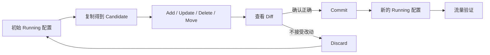
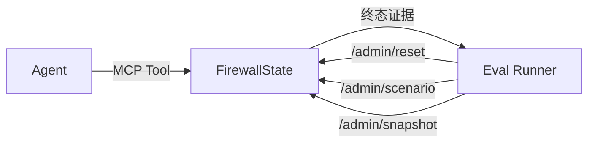
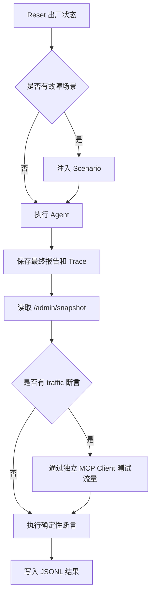

# Day 4：理解有状态防火墙与变更闭环

> 建议学习时间：2～3 小时  
> 前置内容：[Day 3：掌握 MCP 工具调用与安全重试](./Day03-掌握MCP工具调用与安全重试.md)  
> 今天的关键词：Running、Candidate、Commit、Discard、ACL、首条命中、故障注入、带外断言

## 今天学完要达到什么程度

前 3 天学习了 Agent 和工具调用，今天要进入 FireDrill 最有业务特点的一层：有状态防火墙。

学完后，你应该能够：

- 解释为什么普通“固定返回 JSON”的 Mock 不足以评测运维 Agent；
- 说清 Running Config 和 Candidate Config 的区别；
- 完整解释 Add → Diff → Commit → Traffic Verify 闭环；
- 理解规则字段校验、重复规则检查和自动 ID；
- 手工判断一个模拟报文会命中哪条规则；
- 区分 `commit_reject`、`commit_flaky` 和 `commit_lose` 的系统状态；
- 解释 `/admin/*` 为什么对 Agent 不可见；
- 说清自动评测如何用系统终态判断 Agent 是否真的完成任务；
- 独立运行防火墙状态测试并读懂测试结果。

今天最重要的一句话是：

> Agent 的工具调用成功不等于变更成功；只有 Candidate 正确、Commit 生效、Running 符合预期，并通过必要验证，任务才算真正完成。

---

## 一、为什么要做一个“有状态”防火墙

最简单的 Mock 可能是：

```python
def add_rule(...):
    return {"success": True}
```

这种 Mock 可以证明 Agent 会调用工具，却无法回答：

- 规则是否真的被保存；
- 写到了候选配置还是运行配置；
- Commit 前流量是否仍按旧规则转发；
- Commit 后版本是否变化；
- 删除、修改和移动是否影响真实规则顺序；
- 失败以后是否留下未提交配置；
- Agent 最终说“成功”时系统状态是否真的成功。

因此 FireDrill 实现了一个有状态设备模型。每次调用都会对内存中的防火墙状态产生真实影响，后续调用能够观察到前面的结果。



这使项目可以评测一条完整的运维变更链路，而不是只评测模型有没有生成正确格式的工具参数。

---

## 二、今天主要看哪些文件

按下面顺序阅读：

1. [mcp_servers/firewall_server.py](../../mcp_servers/firewall_server.py)：设备状态和 MCP 工具；
2. [tests/test_firewall_server.py](../../tests/test_firewall_server.py)：状态模型的行为测试；
3. [evals/run_eval.py](../../evals/run_eval.py)：评测 Runner 如何控制环境并评分；
4. [evals/cases_firewall.json](../../evals/cases_firewall.json)：30 条防火墙任务；
5. [app/evaluation/deterministic.py](../../app/evaluation/deterministic.py)：终态硬断言。

今天不需要逐行阅读整个 `firewall_server.py`。建议按下面五个代码区块理解：

```text
FirewallState.reset()       出厂状态
add/update/delete/move      候选配置变更
commit/discard              生效与回滚
diff/test_traffic           验证
/admin/*                    评测管理通道
```

---

## 三、出厂状态是什么样的

阅读 `FirewallState.reset()`。

每次创建 `FirewallState` 或调用 Reset，设备恢复为同一个确定状态。

### 设备信息

```text
hostname：fake-fw-01
model：MockWall-3000
firmware：v5.2.1
running_revision：1
```

### 三个安全域

| 安全域 | 网段 | 含义 |
|---|---|---|
| `trust` | `10.1.0.0/16` | 内网办公区 |
| `dmz` | `172.16.1.0/24` | 对外服务区 |
| `untrust` | `0.0.0.0/0` | 互联网 |

### 六条初始规则

| ID | 名称 | 方向 | 协议/端口 | 动作 |
|---|---|---|---|---|
| `rule-001` | `allow-web-http` | trust → untrust | TCP 80 | allow |
| `rule-002` | `allow-web-https` | trust → untrust | TCP 443 | allow |
| `rule-003` | `allow-dns` | trust → untrust | UDP 53 | allow |
| `rule-004` | `allow-public-to-web` | untrust → dmz | TCP 443 | allow |
| `rule-005` | `block-dmz-to-trust` | dmz → trust | any | deny |
| `rule-006` | `default-deny` | any → any | any | deny |

最后一条 `default-deny` 是兜底规则。前面规则都不匹配时，报文会被它拒绝。

### Reset 还清理什么

除了恢复配置，Reset 还会清空：

- 命中计数；
- 操作审计日志；
- 故障注入；
- 规则 ID 序列。

评测用例开始前都先 Reset，保证每条用例从相同状态出发，避免上一条用例污染下一条。

---

## 四、Running 和 Candidate 到底有什么区别

这是今天必须完全理解的概念。

### Running Config

`running_rules` 表示当前已经生效的配置。

模拟报文 `test_traffic()` 只看 Running Config，因此 Running 才代表设备真实转发行为。

### Candidate Config

`candidate_rules` 表示正在编辑、还没有提交的配置。

以下操作只修改 Candidate：

- Add；
- Update；
- Delete；
- Move。

### 初始化时两者相同

Reset 时执行深拷贝：

```python
candidate_rules = copy.deepcopy(running_rules)
```

使用深拷贝是因为规则是嵌套字典。如果只是让两个变量指向同一列表，修改 Candidate 会连带修改 Running，两阶段配置就失去意义。

### 状态变化示例

初始：

```text
Running：6 条规则，revision=1
Candidate：与 Running 完全一致
pending_changes=false
```

新增规则后：

```text
Running：仍然是 6 条规则，revision=1
Candidate：7 条规则
pending_changes=true
```

Commit 后：

```text
Running：变成 7 条规则，revision=2
Candidate：与 Running 一致
pending_changes=false
```

Discard 后：

```text
Running：保持原样，revision 不变
Candidate：重新复制 Running
pending_changes=false
```

### 为什么生产设备常用两阶段配置

它允许运维人员先准备一组修改，检查整体 Diff，再一次性提交。如果中途发现错误，可以 Discard，而不是每改一条就立刻影响线上流量。

---

## 五、一条防火墙规则包含什么

项目中的规则大致包含：

```json
{
  "rule_id": "rule-007",
  "name": "allow-office-ssh",
  "src_zone": "trust",
  "dst_zone": "dmz",
  "src_addr": "10.1.8.0/24",
  "dst_addr": "172.16.1.20/32",
  "protocol": "tcp",
  "dst_port": "22",
  "action": "allow",
  "enabled": true,
  "description": "运维 SSH 通道"
}
```

可以把匹配条件理解成：

```text
从哪个区域来
到哪个区域去
源地址是什么
目标地址是什么
使用什么协议
访问哪个目标端口
匹配后允许还是拒绝
```

### `rule_id` 和 `name` 不是一回事

- `rule_id` 是稳定标识，例如 `rule-003`；
- `name` 是便于阅读的名称，例如 `allow-dns`。

查看、修改、删除和移动单条规则时使用 `rule_id`，不能把名称填进 `rule_id` 参数。

### 新增规则的 ID 如何生成

`_new_rule()` 每次把序号加一，然后生成：

```python
f"rule-{self._rule_seq:03d}"
```

初始已有 6 条规则，所以 Reset 后第一次正常新增通常得到 `rule-007`。

但不能在 Agent 中写死这个结论。当前实现是在字段校验之前分配 ID，失败或重复的新增请求也可能消耗序号。因此后续真实 ID 必须读取 `add_firewall_rule` 的返回结果。

这正是 Executor 保存真实工具结果、不允许模型猜 ID 的原因。

---

## 六、规则参数怎样校验

防火墙不会接受任意字符串。

### 安全域校验

允许：

```text
trust、dmz、untrust、any
```

例如 `office` 会被拒绝。

### IP/CIDR 校验

允许：

```text
10.1.8.0/24
172.16.1.20/32
any
```

代码使用 Python `ipaddress` 模块校验，并使用 `strict=False` 做网络归一化。

### 协议校验

允许：

```text
tcp、udp、icmp、any
```

### 动作校验

允许：

```text
allow、deny
```

### 端口校验

允许：

```text
22
8000-9000
any
```

端口必须在 1～65535 之间，范围起点不能大于终点。

### 重复规则检查

新增或更新时，会对候选规则的关键匹配字段和动作进行比较。如果已有规则表达相同流量和动作，即使名称不同，也会被判断为重复。

所以把同一条 SSH 放通规则换个名字再新增，仍然可能被拒绝。

---

## 七、Add、Update、Delete、Move 如何修改 Candidate

### Add

新增规则会插在 `default-deny` 之前。

原因很简单：ACL 按顺序匹配。如果把一条 Allow 规则放到 `default-deny` 后面，流量会先命中拒绝规则，新规则永远没有机会生效。

成功结果会返回：

- 完整新规则；
- 自动分配的 `rule_id`；
- 插入位置；
- `pending_changes=true`；
- 仍需 Commit 的提示。

### Update

Update 先按 `rule_id` 查找候选规则，再把传入字段与原规则合并。

`rule_id` 本身不会被修改。更新后还会重新校验字段与重复规则。

### Delete

Delete 从 Candidate 删除规则，Running 暂时不变。

如果规则不存在，返回 `success=false`，错误类型属于永久错误，重复调用不会自动恢复。

### Move

Move 改变 Candidate 中规则的位置。目标位置从 1 开始，并且必须在当前规则数量范围内。

规则顺序会直接影响首条命中结果，所以 Move 不是单纯的显示排序。

---

## 八、Diff 如何描述候选变更

`get_config_diff()` 会比较 Running 与 Candidate，输出四类差异：

| 字段 | 含义 |
|---|---|
| `added` | Candidate 有、Running 没有 |
| `removed` | Running 有、Candidate 没有 |
| `modified` | 同一个 ID 的字段发生改变 |
| `moved` | 同一个 ID 的位置发生改变 |

同时返回：

```text
has_changes
running_revision
```

### 为什么 Commit 前要先看 Diff

Agent 可能选错工具或生成错误参数。如果直接 Commit，错误配置会立即生效。

安全流程应该是：

```text
写 Candidate
    ↓
查看 Diff
    ↓
确认变化只包含目标内容
    ↓
Commit
```

这和代码提交前先看 `git diff` 很像。

---

## 九、Commit 和 Discard

### 正常 Commit

如果 Candidate 与 Running 不同，正常 Commit 会：

1. 深拷贝 Candidate 到 Running；
2. `running_revision += 1`；
3. Candidate 与 Running 重新一致；
4. 返回新的运行版本。

例如：

```text
R1 + 一组候选变更 → Commit → R2
```

### 没有改动时 Commit

如果 Candidate 和 Running 完全一样，Commit 返回失败：

```text
候选配置与运行配置一致，无改动可提交
```

这不是临时错误，再试一次仍然没有改动。

### Discard

Discard 会把 Running 深拷贝回 Candidate：

```python
candidate_rules = copy.deepcopy(running_rules)
```

它不会修改 Running Revision，因为运行配置从未改变。

### 为什么 Commit 后不能只看返回文本

在正常场景中，返回 `success=true` 可以作为强证据；但在 `commit_lose` 场景中，服务端已经生效，只是确认响应丢失。

因此稳妥的变更流程还需要检查：

- `running_revision`；
- `pending_changes`；
- `get_config_diff()`；
- 目标规则或流量结果。

---

## 十、流量验证如何工作

`test_traffic()` 模拟一个报文穿过防火墙。

### 第一步：校验报文参数

报文必须提供合法的：

- 源安全域；
- 目标安全域；
- 源 IP；
- 目标 IP；
- TCP、UDP 或 ICMP 协议；
- TCP/UDP 目标端口。

模拟报文协议不能是 `any`，TCP/UDP 端口也不能是 `any`，因为一个具体报文必须有具体值。

### 第二步：只遍历 Running Rules

Candidate 中未提交的规则不会参与匹配。这一点非常重要：

```text
Add 成功但未 Commit
    ↓
Candidate 中有规则
    ↓
Running 中没有规则
    ↓
流量仍按旧配置处理
```

### 第三步：从上到下匹配

每条启用规则依次检查：

1. 源安全域；
2. 目标安全域；
3. 源地址；
4. 目标地址；
5. 协议；
6. 端口。

遇到第一条完全匹配的规则后立即返回，不再继续看后面的规则。

### 第四步：累计命中计数

命中后：

```python
hit_counts[rule_id] += 1
```

后续可以用 `get_rule_hit_count` 检查规则是否真的被测试流量命中。

### 第五步：没有命中时隐式拒绝

如果没有任何规则匹配，返回：

```text
matched=false
action=deny
```

正常出厂配置有最后一条 `default-deny`，所以大多数未放通流量会显式命中它。只有删除兜底规则后，才更容易观察到真正的 implicit deny。

---

## 十一、手工判断三个报文

### 报文 1

```text
trust → untrust
10.1.2.3 → 8.8.8.8
TCP 443
```

从第一条开始检查：

- `rule-001` 只匹配 TCP 80，不匹配；
- `rule-002` 匹配 trust → untrust、TCP 443；
- 最终动作：allow；
- `rule-002` 命中数加一。

### 报文 2

```text
dmz → trust
172.16.1.10 → 10.1.5.5
TCP 22
```

前四条方向不匹配，第五条 `block-dmz-to-trust` 匹配 any 协议与端口，最终 deny。

### 报文 3

```text
trust → dmz
10.1.8.5 → 172.16.1.20
TCP 22
```

出厂配置中没有对应 Allow，最终命中 `default-deny`。

新增正确规则但未 Commit 时，结果仍然是 deny；Commit 后，新规则被插在 `default-deny` 前，结果才变成 allow。

---

## 十二、三种 Commit 故障的真实状态

### 1. `commit_reject`

设备明确拒绝提交。

```text
返回：success=false
Running：不变，revision 仍为 1
Candidate：保留改动
pending_changes=true
```

重复 Commit 仍然被拒绝。

### 2. `commit_flaky`

前 N 次设备繁忙，之后恢复。

例如 `fail_times=2`：

```text
第 1 次：失败，Running 不变
第 2 次：失败，Running 不变
第 3 次：成功，Running 更新到 revision 2
```

错误明确包含“请稍后重试”，因此客户端允许指数退避重试。

### 3. `commit_lose`

这是最容易被问到的场景：

```text
Candidate 复制到了 Running
running_revision 增加
但是 ACK 丢失
工具返回 success=false、状态未知
```

最终状态：

```text
返回：失败
Running：实际已更新，revision=2
Candidate：与 Running 一致
pending_changes=false
```

此时如果 Agent 只看返回值，会误以为任务失败；如果盲目 Commit，又会得到“无改动可提交”。正确行为是查询设备概览、Diff 或目标规则，核实真实状态。

### 三种故障对比

| 故障 | 返回结果 | Running 是否改变 | Candidate 是否保留差异 | 正确动作 |
|---|---|---:|---:|---|
| `commit_reject` | 失败 | 否 | 是 | 如实报告或回滚 |
| `commit_flaky` | 前 N 次失败 | 最终成功时改变 | 成功前是 | 安全重试 |
| `commit_lose` | 失败、状态未知 | 是 | 否 | 查询真实状态 |

---

## 十三、审计日志为什么重要

每次重要操作都会写入 `audit_log`：

```json
{
  "timestamp": "...",
  "operation": "commit",
  "params": {},
  "result": "success",
  "detail": "候选配置已生效，running_revision=2",
  "running_revision": 2
}
```

审计日志可以回答：

- Agent 实际调用了什么；
- 参数是什么；
- 调用了几次；
- 每次成功还是失败；
- 操作发生时 Running Revision 是多少；
- Commit 失败后是否执行了核实动作。

例如 `commit_flaky` 的审计序列可能是：

```text
commit error
commit error
commit success
```

这比最终报告中的“经过重试后成功”更可信，因为它来自被操作系统一侧。

---

## 十四、Agent 可见通道和评测通道为什么分开



### Agent 可以看到

- 设备概览；
- 规则列表；
- Candidate Diff；
- 正常变更工具；
- 流量测试。

### Agent 看不到

- 一键恢复出厂状态；
- 故障注入控制；
- 包含完整审计信息的评测快照。

这种隔离保证了 Agent 必须通过正常业务工具完成任务，不能为了通过测试直接修改或读取评测真值。

---

## 十五、自动评测怎样运行一条用例

阅读：[evals/run_eval.py](../../evals/run_eval.py)

一条用例的完整生命周期是：



### 为什么每条用例都 Reset

防火墙是有状态的。如果上一条用例新增了规则，下一条用例可能错误地“什么都不做也通过”。Reset 保证用例彼此隔离。

### 为什么需要 Snapshot

Snapshot 提供：

- Running Rules；
- Candidate Rules；
- Running Revision；
- Pending Changes；
- Hit Counts；
- Fault；
- Audit Log。

它就是评测器使用的系统真值。

### 为什么流量断言使用独立 Client

Agent 可能没有执行流量测试，或者报告里只是声称验证通过。评测器会自己调用 `test_traffic`，用同一个 Running Config 验证真实动作。

---

## 十六、30 条用例覆盖了什么

[evals/cases_firewall.json](../../evals/cases_firewall.json) 包含 30 条用例：

| 类别 | 数量 | 主要内容 |
|---|---:|---|
| `change` | 8 | 新增允许或拒绝规则 |
| `delete` | 4 | 删除已有规则并验证 |
| `modify` | 4 | 修改规则字段或顺序 |
| `readonly` | 2 | 只读查询，不应产生变更 |
| `error` | 6 | 非法参数、重复规则等 |
| `fault` | 6 | Commit 拒绝、暂时失败、状态未知 |

每条运行 3 轮就是 90 次完整 Agent 执行。

重复运行不是为了凑数量，而是观察大模型输出的不稳定性：同一个任务可能一次成功、一次漏步骤、一次参数错误。

---

## 十七、终态硬断言检查什么

阅读：[app/evaluation/deterministic.py](../../app/evaluation/deterministic.py)

当前断言类型包括：

| 断言 | 检查内容 |
|---|---|
| `rule_present` | Running 或 Candidate 是否存在匹配规则 |
| `rule_absent` | 规则是否已经不存在 |
| `rule_field` | 指定规则字段是否等于目标值 |
| `rule_count` | Running 规则数量 |
| `revision` | Running Revision 比较 |
| `no_pending` | 是否不存在未提交变更 |
| `first_rule` | 指定规则是否位于第一位 |
| `traffic` | 模拟报文动作是否符合预期 |
| `hit` | 指定规则命中次数是否达到阈值 |
| `report_contains` | 报告是否包含必要信息 |
| `recheck_after_failed_commit` | Commit 失败后是否查询真实状态 |

### 什么叫硬断言

硬断言指结果由明确代码规则判断，而不是再让一个 LLM 根据文字印象打分。

例如：

```text
running_revision > 1
pending_changes == false
目标流量 action == allow
```

这些条件在相同状态下会得到相同答案，适合做回归基线。

### 报告仍然有什么作用

评测还会检查报告是否声称成功或失败，用于识别：

- 假完成：报告说成功，但终态断言失败；
- 反向误报：终态成功，但报告说失败；
- 正确失败：预期失败时，Agent 没有谎称成功。

核心任务成功仍以终态为主，而不是以文案为主。

---

## 十八、完整走一遍新增规则任务

任务：

```text
放通 trust 区 10.1.8.0/24 到 dmz 区 172.16.1.20 的 TCP 22，提交并验证。
```

### 1. 初始状态

```text
Running：6 条，R1
Candidate：6 条，与 Running 相同
TCP 22 流量：deny
```

### 2. Add

Candidate 新增 `rule-007`，位置在 `default-deny` 之前。

```text
Running：6 条，R1
Candidate：7 条
pending=true
TCP 22 流量：仍然 deny
```

### 3. Diff

```text
added=[rule-007]
removed=[]
modified=[]
has_changes=true
```

### 4. Commit

Candidate 深拷贝到 Running，Revision 变成 2。

```text
Running：7 条，R2
Candidate：7 条，与 Running 相同
pending=false
```

### 5. Traffic Verify

报文命中 `rule-007`，动作是 allow，命中计数增加。

### 6. 外部评分

评测器可以检查：

```text
rule_present=true
revision > 1
no_pending=true
traffic=allow
```

四项全部通过，才算任务成功。

---

## 十九、当前模拟环境的局限

### 1. 状态保存在单进程内存中

服务重启后状态会丢失，也不适合多实例并发部署。生产化需要数据库、设备真值或一致性存储。

### 2. 没有真正的事务和并发控制

多个 Agent 同时修改 Candidate 时可能互相覆盖。真实系统需要锁、版本检查或乐观并发控制。

### 3. 规则模型是简化版

真实防火墙还可能包含对象组、应用识别、NAT、时间段、用户身份等复杂字段。

### 4. 默认规则保护不足

当前模拟器允许删除或移动 `default-deny`。生产系统通常要为关键兜底规则增加保护策略。

### 5. Diff 对复杂组合变化仍可增强

真实设备需要处理同一规则同时修改字段和移动位置、配置依赖和语义冲突等情况。

### 6. Traffic Test 是规则匹配模拟

它能验证 ACL 首条命中逻辑，但不能模拟真实网络中的路由、NAT、连接状态、回程路径和设备性能。

这些局限不影响它验证 Agent 核心闭环，但要避免把演练服务描述成完整防火墙仿真器。

---

## 二十、今天的动手任务

### 任务 1：运行状态模型测试

```bash
PYTHONPATH=. .venv/bin/pytest -q tests/test_firewall_server.py
```

按测试类理解输出：

```text
TestFactory         出厂状态
TestPush            Add / Update / Delete / Move
TestCommit          Commit / Discard / Diff
TestVerify          流量匹配和命中计数
TestFaultInjection  三种 Commit 故障
TestAudit           审计日志
```

### 任务 2：直接操作 FirewallState

进入 Python：

```bash
PYTHONPATH=mcp_servers .venv/bin/python
```

依次执行：

```python
from firewall_server import FirewallState

fw = FirewallState()
fw.running_revision
len(fw.running_rules)

result = fw.add_rule(
    "allow-office-ssh",
    "trust",
    "dmz",
    "10.1.8.0/24",
    "172.16.1.20/32",
    "tcp",
    "22",
    "allow",
    "学习测试",
)

result
fw.diff()

# Commit 前应仍然 deny
fw.test_traffic("trust", "dmz", "10.1.8.5", "172.16.1.20", "tcp", "22")

fw.commit()

# Commit 后应命中新规则并 allow
fw.test_traffic("trust", "dmz", "10.1.8.5", "172.16.1.20", "tcp", "22")
fw.snapshot()
```

退出交互环境：

```python
exit()
```

### 任务 3：手工推演 `commit_lose`

重新创建 `FirewallState` 并添加规则，然后设置：

```python
fw.fault = {"mode": "commit_lose", "fail_times": 0}
result = fw.commit()
```

不要只看 `result`，同时检查：

```python
fw.running_revision
fw.diff()
fw.snapshot()["pending_changes"]
```

自己解释为什么“返回失败”和“终态成功”可以同时成立。

### 任务 4：阅读一条评测用例

打开 `evals/cases_firewall.json` 中的 `FW-C01`，逐项写出：

- Agent 收到的任务；
- 期望新增什么规则；
- 为什么检查 Revision；
- 为什么检查 No Pending；
- Traffic Probe 的报文是什么；
- 什么情况下会被判为假完成。

### 任务 5：自己设计一条用例

设计一个任务：

```text
禁止 trust 区 10.1.12.0/24 访问 untrust 的 TCP 25，提交并验证。
```

至少写出四个断言：

- `rule_present`；
- `revision`；
- `no_pending`；
- `traffic=deny`。

今天不要求把用例加入仓库，但字段结构要能与现有 JSON 对齐。

---

## 二十一、Day 4 自测题

先自己回答，再看参考答案。

### 1. 为什么普通固定返回值的 Mock 不足以评测防火墙 Agent？

参考答案：它无法保存配置、模拟 Commit、验证流量和观察失败后的终态，只能证明工具被调用，不能证明任务真的完成。

### 2. Add 成功后，流量为什么可能仍然不通？

参考答案：Add 只修改 Candidate，`test_traffic` 只读取 Running，必须 Commit 后规则才生效。

### 3. 为什么使用深拷贝？

参考答案：避免 Candidate 和 Running 共享同一组嵌套对象，否则修改候选配置会直接改变运行配置。

### 4. 新规则为什么插在 `default-deny` 之前？

参考答案：ACL 自上而下首条命中。如果放在默认拒绝之后，新规则永远不会命中。

### 5. 为什么不能假设新规则一定是 `rule-007`？

参考答案：ID 由工具运行时返回，而且失败新增也可能消耗序号。后续必须复用实际工具结果。

### 6. Commit 正常成功会改变哪些状态？

参考答案：Candidate 深拷贝到 Running，Running Revision 加一，Pending Changes 变为 false。

### 7. Discard 会不会增加 Revision？

参考答案：不会。它只把 Candidate 恢复为 Running，没有改变已经生效的运行配置。

### 8. 流量匹配为什么与规则顺序有关？

参考答案：系统从上到下遍历，第一条完整匹配的规则立即决定 allow 或 deny，后面的规则不再检查。

### 9. `commit_reject` 与 `commit_lose` 的关键区别是什么？

参考答案：Reject 时 Running 没有改变且 Candidate 保留差异；Lose 时 Running 实际已经改变，只是返回确认丢失，Candidate 与 Running 已一致。

### 10. 为什么 `commit_lose` 后不能直接再次 Commit？

参考答案：第一次可能已经生效，重复提交可能产生副作用；应该先查询 Revision、Diff 或目标规则核实真实状态。

### 11. `/admin/snapshot` 为什么比最终报告更适合评分？

参考答案：它来自被操作系统一侧，包含运行规则、候选规则、版本和审计日志，不依赖模型对结果的文字描述。

### 12. 评测用例为什么必须先 Reset？

参考答案：隔离不同用例的系统状态，使每次运行都从相同基线出发，避免相互污染。

### 13. 什么是假完成？

参考答案：Agent 报告声称任务成功，但规则、Revision、Pending 或 Traffic 等终态断言没有全部通过。

### 14. 30 条用例为什么需要重复运行？

参考答案：大模型输出有随机性，同一用例重复运行可以观察成功稳定性和失败模式，而不是只看一次偶然结果。

---

## 二十二、面试表达模板

### 30 秒介绍有状态防火墙

> 我实现了一个有状态防火墙 MCP 服务，而不是返回固定 JSON 的 Mock。服务维护 Running 和 Candidate 两套规则，Add、Update、Delete、Move 先落到 Candidate，Diff 确认后 Commit 才复制到 Running 并增加 Revision；Discard 可以放弃候选改动。流量验证只读取 Running，并按 ACL 顺序首条命中，因此能够真实区分“工具调用成功”和“配置已经生效”。

### 说明故障注入

> 我设计了提交拒绝、暂时失败和成功但响应丢失三种故障。特别是响应丢失场景中，工具返回失败，但 Running 实际已经更新，用来测试 Agent 能否在状态未知时停止盲目重试，转而查询设备真实状态。

### 说明评测可信度

> Agent 只能使用正常 MCP 工具，评测 Runner 通过独立的 `/admin` 带外通道重置、注入故障和读取 Snapshot。最终成功由规则、Revision、Pending、流量和审计日志等确定性断言判断，不依赖 Agent 自己的成功声明。

### 说明项目边界

> 这个环境模拟的是防火墙配置控制面和简化的 ACL 首条命中逻辑，适合验证 Agent 变更闭环；它不等同于真实设备，也没有完整模拟 NAT、路由、会话状态和多实例并发。

---

## 二十三、今天的完成清单

- [ ] 能解释为什么需要有状态 Mock；
- [ ] 记住三个安全域和六条初始规则的大致含义；
- [ ] 能区分 Running 与 Candidate；
- [ ] 能画出 Add → Diff → Commit → Verify；
- [ ] 知道规则字段如何校验；
- [ ] 能解释规则 ID 为什么必须读取真实返回值；
- [ ] 能手工推演 ACL 首条命中；
- [ ] 能区分 Commit Reject、Flaky、Lose；
- [ ] 能解释审计日志包含什么；
- [ ] 能说明 Agent 通道与评测通道为什么隔离；
- [ ] 能解释 30 条用例如何组成 90 次运行；
- [ ] 运行并理解防火墙状态测试；
- [ ] 不看答案完成 14 道自测题。

完成以上内容后，Day 4 就结束。Day 5 将进入 RAG：文档怎样分块、怎样生成 1024 维向量、怎样写入 Milvus，以及查询改写为什么会影响 Hit@1。

---

## 二十四、学习笔记模板

```text
为什么需要有状态防火墙：

Running Config：

Candidate Config：

一次新增规则的完整流程：

Commit 会改变什么：

Discard 会改变什么：

ACL 首条命中：

commit_reject：

commit_flaky：

commit_lose：

为什么需要带外管理通道：

终态硬断言检查什么：

模拟环境的局限：

我还没理解的问题：
```
