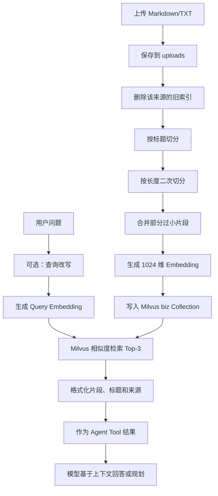

# Day 5：掌握 RAG 知识链路与检索评测

> 建议学习时间：2～3 小时  
> 前置内容：[Day 4：理解有状态防火墙与变更闭环](./Day04-理解有状态防火墙与变更闭环.md)  
> 今天的关键词：Chunk、Embedding、Vector Store、Milvus、Top-K、Query Rewrite、Hit@K

## 今天学完要达到什么程度

前 4 天掌握了 Agent、MCP 和防火墙闭环。今天学习项目的另一条核心能力：RAG 知识检索。

学完后，你应该能够：

- 用通俗语言解释 RAG、Embedding 和向量检索；
- 画出文档从上传到被 Agent 使用的完整链路；
- 解释为什么先按 Markdown 标题切分，再按长度二次切分；
- 说清项目实际使用的 Chunk 大小、Overlap 和元数据；
- 解释 1024 维向量是什么，以及 Milvus 中保存了什么；
- 说清 Top-3 检索和 L2 距离；
- 区分 RAG Agent 自主调用知识工具和 AIOps Planner 固定预检索；
- 正确解释查询改写实验与 Hit@1、Hit@3；
- 明确实验是 36 条查询，不是 35 条；
- 说出当前 RAG 链路的局限和下一步优化方向。

今天最重要的一句话是：

> RAG 不是让模型“记住文档”，而是在回答前先从外部知识库找到相关片段，再把片段作为上下文交给模型。

---

## 一、为什么需要 RAG

大模型本身有三个常见问题：

- 不知道企业内部文档；
- 知识可能过时；
- 遇到不确定内容时可能编造答案。

例如用户问：

> 当前项目内部规定 CPU 持续超过 80% 时应该怎样排查？

这个答案可能写在项目自己的运维文档里。与其期待模型训练时见过，不如在回答前先检索文档。


RAG 是 `Retrieval-Augmented Generation`，中文一般叫“检索增强生成”。

可以把它想象成开卷考试：

- 大模型负责阅读和组织答案；
- 向量库负责从资料中找到可能相关的页；
- RAG 负责把题目和资料页一起交给模型。

### RAG 不等于微调

RAG 不修改模型参数。新增文档时，只需要重新切分和建索引。

微调则会改变模型参数，适合调整行为模式、输出风格或学习稳定任务模式，但更新知识的成本通常更高。

---

## 二、项目中的完整 RAG 链路



对应代码分层：

| 阶段 | 文件 |
|---|---|
| 文件上传 | [app/api/file.py](../../app/api/file.py) |
| 文档分块 | [document_splitter_service.py](../../app/services/document_splitter_service.py) |
| 向量生成 | [vector_embedding_service.py](../../app/services/vector_embedding_service.py) |
| 文件索引 | [vector_index_service.py](../../app/services/vector_index_service.py) |
| 向量库封装 | [vector_store_manager.py](../../app/services/vector_store_manager.py) |
| Milvus 管理 | [milvus_client.py](../../app/core/milvus_client.py) |
| 知识检索工具 | [knowledge_tool.py](../../app/tools/knowledge_tool.py) |
| RAG Agent | [rag_agent_service.py](../../app/services/rag_agent_service.py) |
| 检索实验 | [evals/run_rag_eval.py](../../evals/run_rag_eval.py) |

---

## 三、第一步：文件上传

阅读：[app/api/file.py](../../app/api/file.py)

上传接口是：

```text
POST /api/upload
```

### 支持的文件类型

当前只支持：

```text
.md
.txt
```

### 文件大小限制

单个文件最大 10 MB。

### 文件名处理

上传前会把空格和部分特殊字符替换为下划线，降低路径兼容问题。

例如：

```text
CPU 排查?.md → CPU_排查_.md
```

### 同名文件如何更新

如果 `uploads` 中已经存在同名文件，先删除旧文件，再写入新内容，然后重新创建向量索引。

### 一个容易忽略的行为

文件保存成功后，如果向量索引失败，接口仍然返回上传成功，只在日志中记录索引失败。

也就是说：

```text
文件上传成功 ≠ 文件已经可以被检索
```

生产化时最好把文件状态明确记录为：

```text
uploaded → indexing → indexed / failed
```

让前端和用户知道索引是否真正完成。

---

## 四、第二步：文档分块

阅读：[app/services/document_splitter_service.py](../../app/services/document_splitter_service.py)

为什么不能把整篇文档直接转成一个向量？

假设一篇文档同时包含：

```text
CPU 高负载原因
排查命令
容器 CPU 限额
告警阈值
处理建议
```

整篇只生成一个向量时，不同主题被混在一起，检索很难定位到具体段落；整篇内容也可能超出模型上下文。

但切得太碎也不好：一句话缺少上下文，模型无法理解它属于什么章节。

因此项目使用三阶段处理。

### 第一阶段：按 Markdown 标题切分

标题分割器识别：

```text
# 一级标题
## 二级标题
```

当前故意不按 `###` 三级标题切分，避免片段过度碎片化。

配置：

```python
strip_headers=False
```

表示正文中保留标题。这样向量内容不仅有段落，还有“它属于哪个主题”的文字信息。

### 第二阶段：按长度二次切分

配置文件中的：

```text
chunk_max_size=800
chunk_overlap=100
```

但实际递归分割器使用：

```python
chunk_size = chunk_max_size * 2
```

所以当前真实的二次切分上限目标是 **1600 字符**，Overlap 是 **100 字符**。

面试时不要只说“Chunk Size 是 800”。准确说法是：

> 配置基数是 800，当前二次递归切分实际使用 1600 字符，并保留 100 字符重叠。

### 为什么需要 Overlap

假设关键结论刚好横跨两个 Chunk 的边界，没有重叠时上下文可能被截断。

```text
Chunk A 末尾：当 CPU 持续高于 80% 时，首先应该……
Chunk B 开头：检查是否存在死循环进程……
```

保留少量重叠可以让边界附近信息同时出现在相邻 Chunk 中。

### 第三阶段：合并部分小片段

代码尝试把小于 300 字符的片段与前一片段合并，前提是合并后不会明显超过 1600 字符。

注意：当前算法不能保证最终所有 Chunk 都大于 300 字符。例如文档开头的标题摘要仍可能单独成为一个小片段。这是实现细节，也是后续可优化点。

### 当前 5 篇知识文档的实际切分结果

使用当前代码得到：

| 文档 | Chunk 数 |
|---|---:|
| `cpu_high_usage.md` | 3 |
| `disk_high_usage.md` | 6 |
| `memory_high_usage.md` | 4 |
| `service_unavailable.md` | 4 |
| `slow_response.md` | 4 |
| 合计 | 21 |

### 每个 Chunk 还带什么元数据

主要包括：

- `_source`：完整来源路径；
- `_extension`：文件扩展名；
- `_file_name`：文件名；
- `h1`、`h2`：Markdown 标题信息。

元数据用于展示来源、过滤数据和删除旧索引。

---

## 五、第三步：Embedding

阅读：[app/services/vector_embedding_service.py](../../app/services/vector_embedding_service.py)

### Embedding 是什么

Embedding 会把一段文字转换成一串数字：

```text
"CPU 使用率持续超过 80%"
        ↓
[0.013, -0.082, 0.104, ..., 0.027]
```

这串数字可以看作文本在语义空间中的坐标。含义相近的文本，向量通常更接近。

### 1024 维是什么意思

当前使用：

```text
text-embedding-v4
dimensions=1024
```

也就是说每个 Chunk 和每个查询都会被转换为包含 1024 个浮点数的向量。

维度并不是“1024 个关键词”，每一维通常没有人类可直接解释的固定含义。它们共同表达文本的语义特征。

### 文档向量和查询向量必须兼容

如果文档用 1024 维 v4 向量，查询也必须使用同一套兼容的 Embedding 配置。否则无法正确比较距离。

Milvus Manager 启动时会检查 Collection 的向量维度。如果旧 Collection 维度不是 1024，当前代码会删除旧 Collection 并重新创建。

这是一个有数据破坏风险的行为，生产环境应使用版本化 Collection 和迁移流程，而不是启动时自动删库重建。

### 批量嵌入和单条嵌入

- `embed_documents()`：批量为多个 Chunk 生成向量；
- `embed_query()`：为一条用户查询生成向量。

它们实现了 LangChain 标准 `Embeddings` 接口，因此 `langchain_milvus` 可以自动调用。

### API Key 行为

Embedding Service 在模块导入时创建全局实例。如果没有配置 DashScope API Key，会直接抛出异常。

因此虽然 Milvus 连接失败可以降级，但“完全没有模型 API Key”当前仍可能导致应用在导入阶段启动失败。这是需要区分的两个故障。

---

## 六、第四步：Milvus 保存了什么

阅读：[app/core/milvus_client.py](../../app/core/milvus_client.py)

项目统一使用 Collection：

```text
biz
```

每条记录包含：

| 字段 | 类型 | 含义 |
|---|---|---|
| `id` | VARCHAR | UUID 主键 |
| `vector` | FLOAT_VECTOR(1024) | 文本向量 |
| `content` | VARCHAR | Chunk 原文，最大 8000 字符 |
| `metadata` | JSON | 来源文件和标题等信息 |

### Milvus Lite 和服务端模式

项目支持两种运行方式：

#### Milvus Lite

设置 `milvus_lite_path` 后，使用一个本地 `.db` 文件，不需要单独启动 Docker 服务。

优点：启动简单，适合个人项目和评测。

限制：本地数据库文件通常只能被一个进程持有写锁，并发启动多个进程容易遇到 `DataDirLockedError`。

#### Milvus Server

通过 Host 和 Port 连接独立 Milvus 服务，更适合长期运行和多进程访问。

### 向量索引

当前距离类型是：

```text
L2 欧氏距离
```

直观理解：两个向量坐标之间的距离越小，文本语义越接近。

索引类型：

- Lite 模式使用 `FLAT`；
- Server 模式使用 `IVF_FLAT`，`nlist=128`。

`FLAT` 会直接比较全部向量，小数据集准确直观；`IVF_FLAT` 先把向量分组再检索，适合更大规模数据，但需要调节索引参数。

---

## 七、第五步：文件怎样写入向量库

阅读：[app/services/vector_index_service.py](../../app/services/vector_index_service.py)

`index_single_file()` 的流程是：

```text
读取文件
  → 删除这个来源的旧 Chunk
  → 重新分块
  → 批量生成 Embedding
  → 写入 Milvus
```

### 为什么先按来源删除旧数据

同名文档更新后，如果不删除旧 Chunk，检索可能同时返回新旧版本。

删除表达式使用元数据：

```text
metadata["_source"] == 文件路径
```

### 每个 Chunk 的 ID

Vector Store 配置 `auto_id=False`，应用为每个 Chunk 生成 UUID。

### 当前更新过程不是原子的

代码先删除旧索引，再为新文档生成向量。如果新文档 Embedding 失败，旧索引已经删除，新索引还没有写入。

生产化可以使用：

```text
新版本写入临时 Collection
  → 校验完成
  → 原子切换 Alias
  → 删除旧版本
```

这样更新失败时仍能继续使用旧索引。

---

## 八、第六步：用户问题怎样被检索

阅读：[app/tools/knowledge_tool.py](../../app/tools/knowledge_tool.py)

知识检索工具定义为：

```python
retrieve_knowledge(query: str)
```

### 检索流程

```text
用户 Query
  → 生成 Query Embedding
  → Milvus L2 相似度搜索
  → 返回 Top-3 Chunk
  → 格式化标题、来源和内容
```

Top-K 来自配置：

```text
rag_top_k=3
```

### Top-3 是什么意思

Milvus 会按相似度返回最相关的 3 个 Chunk，而不是 3 篇不同文档。

所以结果可能是：

```text
service_unavailable.md
service_unavailable.md
cpu_high_usage.md
```

前两条来自同一篇文档的不同 Chunk，这是正常行为。

### 返回 Content 和 Artifact

工具使用：

```python
@tool(response_format="content_and_artifact")
```

它返回两部分：

- Content：格式化后的文本，提供给模型；
- Artifact：原始 `Document` 列表，保留元数据供程序使用。

### Milvus 不可用时怎样降级

如果 Vector Store 初始化失败，`retrieve_knowledge` 不会继续抛异常拖垮 Agent，而是返回：

```text
知识库当前不可用（Milvus 未连接）。
```

其他 MCP、监控和防火墙能力仍可继续运行。

---

## 九、谁来决定什么时候检索

这个项目有两条不同使用方式，面试时要区分。

### RAG 对话 Agent：模型自主选择

[rag_agent_service.py](../../app/services/rag_agent_service.py) 把 `retrieve_knowledge` 与其他工具一起注册给 Agent。

模型根据用户问题决定是否调用知识工具。例如：

```text
“CPU 高负载怎样排查？” → 很可能调用知识库
“现在几点？” → 使用时间工具，不必检索知识库
```

### AIOps Planner：规划前固定检索

Plan-Execute-Replan 的 Planner 会在生成计划前主动调用一次 `retrieve_knowledge`，不由模型先选择是否检索。

这样做的目的是让规划阶段尽量参考内部运维经验，但也会增加不必要检索和延迟。

准确说法是：

> 知识检索被封装成 Agent Tool，在通用 RAG Agent 中由模型自主决定；AIOps Planner 当前还会在规划前固定执行一次经验检索。

---

## 十、查询改写是什么

用户的问题可能很口语化、信息分散：

```text
这服务老是挂，是不是该熔断？降级和限流又什么时候用？
```

查询改写让 LLM 先把它转换成更适合检索的表达：

```text
熔断机制、降级策略、限流措施的定义及其应用场景
```

目标是：

- 保留关键术语；
- 去掉口语和无关表达；
- 补全检索意图；
- 不直接回答问题，只生成新的 Query。

### 查询改写不一定总会提升

它也可能：

- 错误理解用户意图；
- 丢掉罕见关键词；
- 引入原问题没有的信息；
- 增加一次 LLM 调用、延迟和成本。

因此是否使用 Query Rewrite 应该通过评测决定，而不是凭感觉上线。

### 当前主链路是否已经启用改写

没有。当前 `retrieve_knowledge` 直接使用收到的 Query 检索。

Query Rewrite 目前存在于独立对照实验 `evals/run_rag_eval.py` 中，用于验证方向性效果。

面试时可以说“完成了查询改写对照实验”，不要说“线上检索链路已经全面启用查询改写”。

---

## 十一、检索对照实验怎么设计

阅读：[evals/run_rag_eval.py](../../evals/run_rag_eval.py)

### 数据集

[evals/rag_queries.json](../../evals/rag_queries.json) 当前实际包含 **36 条标注查询**，覆盖 5 篇运维文档：

| 目标文档 | 查询数 |
|---|---:|
| `cpu_high_usage.md` | 7 |
| `disk_high_usage.md` | 7 |
| `memory_high_usage.md` | 7 |
| `service_unavailable.md` | 8 |
| `slow_response.md` | 7 |
| 合计 | 36 |

每条数据包括：

```json
{
  "q": "CPU使用率持续超过80%的告警怎么处理",
  "doc": "cpu_high_usage.md"
}
```

`doc` 是人工标注的期望来源文档。

### 三个变体

| 变体 | Embedding | Query |
|---|---|---|
| `naive_v4` | text-embedding-v4，1024 维 | 原始 Query |
| `rewrite_v4` | text-embedding-v4，1024 维 | LLM 改写 Query |
| `naive_v2` | text-embedding-v2，默认维度 | 原始 Query |

每个变体都会：

1. 使用相同 5 篇文档；
2. 复用项目相同的分块逻辑；
3. 使用独立 Collection；
4. 每次 `drop_old=True` 重新建索引；
5. 对同一组 36 条查询检索 Top-3。

### 为什么使用独立数据库

实验使用：

```text
volumes/eval_rag.db
```

而不是主链路的数据库。这样可以避免占用主 Milvus Lite 文件锁，也避免实验重建 Collection 破坏业务索引。

---

## 十二、Hit@1 和 Hit@3 怎么计算

### Hit@1

期望文档是不是排在检索结果第一位：

```text
Hit@1 = 第一名正确的查询数 / 查询总数
```

例如 36 条中 35 条第一名正确：

```text
35 / 36 = 97.22%
```

### Hit@3

期望文档是否出现在前三个 Chunk 的来源中：

```text
Hit@3 = 前三名包含正确文档的查询数 / 查询总数
```

注意：这里判断的是目标**文档来源**是否命中，而不是答案文本是否正确，也不是 Chunk 标注级 Recall。

### 实验结果

当前保存结果：[evals/results/rag_eval.json](../../evals/results/rag_eval.json)

| 变体 | Hit@1 | Hit@3 |
|---|---:|---:|
| `naive_v4` | 35/36 = 97.2% | 36/36 = 100% |
| `rewrite_v4` | 36/36 = 100% | 36/36 = 100% |
| `naive_v2` | 34/36 = 94.4% | 35/36 = 97.2% |

所以正确的简历口径应该是：

> 在 36 条标注查询、3 个检索变体的对照实验中，查询改写将 Hit@1 从 97.2% 提升至 100%，属于小语料上的方向性证据。

此前使用“35 条”的说法与当前数据文件不一致，应统一改为 36 条。

---

## 十三、看懂那一条被 Query Rewrite 修复的查询

`naive_v4` 唯一没有排在第一的查询是：

```text
熔断、降级、限流分别是什么，什么时候用
```

期望文档：

```text
service_unavailable.md
```

原始 Query 的 Top-3 来源：

```text
cpu_high_usage.md
slow_response.md
service_unavailable.md
```

因此：

```text
Hit@1=false
Hit@3=true
```

改写后的 Query：

```text
熔断机制、降级策略、限流措施的定义及其应用场景
```

改写后 Top-3：

```text
service_unavailable.md
service_unavailable.md
cpu_high_usage.md
```

目标文档来到第一位，因此 Hit@1 从失败变为成功。

这说明改写在这个样本上帮助模型把口语化问题转换成更接近文档表达的检索词。

---

## 十四、为什么这个结果不能过度宣传

36 条查询和 5 篇文档的语料规模很小，100% 不代表真实生产环境也能达到 100%。

当前实验还存在这些限制：

- 查询由人工构造，可能与文档用词接近；
- 只标注目标文档，没有标注最佳 Chunk；
- 没有测最终答案正确率；
- 没有测引用忠实度和幻觉率；
- 没有报告延迟与成本；
- Query Rewrite 本身也是模型调用，存在不稳定性；
- 没有重复运行改写变体衡量方差；
- 语料中只有 5 篇文档，检索难度较低。

因此面试时应使用：

```text
小语料上的方向性证据
```

不要使用：

```text
证明查询改写让生产 RAG 达到 100% 准确率
```

### 更完整的 RAG 评测应该增加什么

- Recall@K；
- MRR；
- NDCG；
- Chunk 级人工标注；
- 最终答案正确性；
- 引用忠实度；
- 无答案问题拒答率；
- 检索延迟、改写延迟和 Token 成本；
- 多次运行均值和方差。

---

## 十五、RAG 如何进入两个 Agent

### 进入通用 RAG Agent

`RagAgentService` 使用 `create_agent()`，把知识、时间、Prometheus 和 MCP 工具一起交给模型。

它还使用 `MemorySaver` 保存会话，并在模型调用前裁剪长消息历史：

- 保留第一条系统消息；
- 保留最近约 6 条消息；
- 防止对话历史无限增长。

### 进入 AIOps Planner

Planner 在制定计划前调用知识工具，把经验文档放入 `experience_context`，再与工具描述和用户任务一起生成 Plan。

例如用户要求排查 CPU 告警时，Planner 可以先检索内部排查步骤，再规划监控、日志和分析顺序。

### RAG 在这里扮演什么角色

RAG 不直接决定系统状态，也不会执行防火墙变更。它提供的是规划或回答所需的知识上下文。

所以 RAG 失败时应该降级，而不应该自动阻止所有运维工具工作。

---

## 十六、当前 RAG 链路的主要局限

### 1. 主链路没有 Query Rewrite

改写实验有效，但还没有作为可配置策略接入 `retrieve_knowledge`。

### 2. 只有单路向量检索

没有 BM25 关键词检索、Hybrid Search 或 Reranker。遇到错误码、命令名等精确关键词时，纯向量检索可能不稳定。

### 3. 没有相似度阈值

Top-3 总会尝试返回结果，即使三条都不够相关。生产系统需要最低相关度阈值或无答案判断。

### 4. 文档更新不是原子的

旧索引先删除，新索引失败时可能出现知识缺失。

### 5. Milvus Lite 有文件锁限制

多个本地进程同时访问同一数据库会发生锁冲突。评测已用独立数据库规避，但主服务仍需要明确单进程或迁移到服务端 Milvus。

### 6. 缺少引用约束

工具返回来源，但最终回答没有强制逐条引用，也没有验证回答是否完全来自检索证据。

### 7. 缺少完整可观测指标

还可以记录：

- Query 与改写 Query；
- Top-K 文档及距离；
- 检索耗时；
- Embedding 耗时；
- 最终采用了哪些 Chunk；
- 用户反馈。

---

## 十七、今天的动手任务

### 任务 1：查看 5 篇知识文档

```bash
find aiops-docs -maxdepth 1 -type f -name '*.md' -print | sort
```

每篇只看一级、二级标题，思考为什么某些查询容易混淆 `cpu_high_usage` 和 `slow_response`。

### 任务 2：运行分块，不调用外部模型

进入 Python：

```bash
PYTHONPATH=. .venv/bin/python
```

执行：

```python
from pathlib import Path
from app.services.document_splitter_service import document_splitter_service

for path in sorted(Path("aiops-docs").glob("*.md")):
    docs = document_splitter_service.split_markdown(
        path.read_text(encoding="utf-8"),
        str(path),
    )
    print(path.name, len(docs), [len(d.page_content) for d in docs])
```

检查总 Chunk 数是否为 21，并观察为什么仍然存在小于 300 字符的片段。

### 任务 3：检查一个 Chunk 的元数据

继续在 Python 中执行：

```python
path = Path("aiops-docs/cpu_high_usage.md")
docs = document_splitter_service.split_markdown(
    path.read_text(encoding="utf-8"),
    str(path),
)

print(docs[0].page_content)
print(docs[0].metadata)
```

确认内容保留标题，元数据包含来源和标题字段。

### 任务 4：核对实验分母

退出 Python 后执行：

```bash
jq 'length' evals/rag_queries.json

jq 'map({
  variant,
  n,
  hit1: ."hit@1",
  hit3: ."hit@3"
})' evals/results/rag_eval.json
```

确认 `n=36`，并自己算一遍 35/36 和 34/36。

### 任务 5：找到被改写修复的查询

```bash
jq -r '
  .[]
  | select(.variant == "naive_v4")
  | .details[]
  | select(.hit1 | not)
  | {q, q_used, expect, got, hit1, hit3}
' evals/results/rag_eval.json
```

再到 `rewrite_v4` 中查同一个 Query，对比 `q_used` 和 Top-3。

### 任务 6：设计一次生产化实验

在纸上写一个新的实验表：

| 变体 | Rewrite | Hybrid | Reranker | 指标 |
|---|---:|---:|---:|---|
| A | 否 | 否 | 否 | 基线 |
| B | 是 | 否 | 否 | 改写收益 |
| C | 否 | 是 | 否 | 混合检索收益 |
| D | 是 | 是 | 是 | 完整链路 |

指标至少包含 Hit@1、MRR、答案正确率、延迟和成本。

---

## 十八、Day 5 自测题

先自己回答，再看参考答案。

### 1. RAG 和微调的核心区别是什么？

参考答案：RAG 在推理时检索外部知识并放入上下文，不修改模型参数；微调会改变模型参数。

### 2. 为什么不能整篇文档只生成一个向量？

参考答案：长文档包含多个主题，单个向量会稀释局部语义，而且返回整篇内容成本高、定位差。

### 3. 为什么先按标题切分？

参考答案：尽量保持语义章节完整，让同一个 Chunk 中的内容属于相近主题，并保留标题上下文。

### 4. 当前实际 Chunk Size 是 800 还是 1600？

参考答案：配置基数是 800，但递归二次切分使用 `chunk_max_size * 2`，所以实际目标上限是 1600 字符，Overlap 为 100。

### 5. 1024 维是不是 1024 个关键词？

参考答案：不是。它是模型学习出的语义空间坐标，各维通常没有可直接解释的固定关键词含义。

### 6. Milvus 中保存了什么？

参考答案：每个 Chunk 的 UUID、1024 维向量、原始文本和来源/标题等 JSON 元数据。

### 7. Top-3 为什么可能来自同一篇文档？

参考答案：检索单位是 Chunk，不是文档；同一文档的多个 Chunk 都可能排名靠前。

### 8. Milvus 不可用时系统怎样处理？

参考答案：Vector Store 置为不可用，知识工具返回降级提示，其他 Agent 和 MCP 能力可以继续工作。

### 9. RAG Agent 和 AIOps Planner 的检索时机有什么区别？

参考答案：RAG Agent 把知识库作为 Tool，由模型决定是否调用；AIOps Planner 当前在规划前固定检索一次经验文档。

### 10. Query Rewrite 当前是否已进入主检索链路？

参考答案：没有，目前只在独立对照实验中验证。

### 11. Hit@1=100% 是什么意思？

参考答案：这 36 条查询的第一条检索结果都来自人工标注的目标文档，不代表最终回答 100% 正确，也不代表生产数据上 100%。

### 12. 为什么实验数据应该说 36 条？

参考答案：当前 `rag_queries.json` 和结果字段 `n` 都是 36；97.2% 对应 35/36。

### 13. 为什么实验使用单独的 Milvus Lite 文件？

参考答案：避免与主数据库争抢文件锁，也避免 `drop_old=True` 重建实验 Collection 时影响业务索引。

### 14. 文档更新为什么可能出现短暂知识缺失？

参考答案：当前流程先删除旧来源数据，再生成并写入新向量；如果新索引失败，旧数据已经不存在。

### 15. 纯向量 Top-K 有什么不足？

参考答案：对错误码、命令名等精确词可能不如关键词检索；没有阈值时还可能返回不相关内容，可以通过 Hybrid Search、Reranker 和无答案判断改进。

---

## 十九、面试表达模板

### 30 秒介绍 RAG 链路

> 项目支持 Markdown 和文本上传，先按一级、二级标题切分，再按约 1600 字符二次切分并保留 100 字符重叠。每个 Chunk 使用 DashScope text-embedding-v4 生成 1024 维向量，写入 Milvus 的 biz Collection，同时保存来源和标题元数据。查询时生成 Query Embedding，按 L2 距离返回 Top-3，并封装成知识检索 Tool 提供给 Agent。

### 说明查询改写实验

> 我用 5 篇运维文档构建了 36 条标注查询，对比原始 v4、查询改写 v4 和原始 v2 三个变体。查询改写把 Hit@1 从 35/36，也就是 97.2%，提升到 36/36；Hit@3 都是 100%。因为语料和查询规模较小，我把它定义为方向性证据，没有直接宣称生产准确率提升。

### 说明为什么没有直接上线改写

> Query Rewrite 会增加模型调用成本和延迟，也可能改变用户意图。当前先通过离线实验验证方向，后续需要扩大真实查询集、重复运行并同时评估答案质量、延迟和成本，再决定是否作为可配置策略进入主链路。

### 说明降级能力

> Milvus 连接失败时，知识 Tool 返回不可用提示，不阻塞防火墙和监控工具。但当前 Embedding Service 在导入阶段仍要求 API Key，索引更新也不是原子的，这些是后续工程化重点。

---

## 二十、简历指标的正确口径

建议把 RAG 项目 bullet 统一为：

> 设计文档上传、标题与长度分块、1024 维向量化及 Milvus Top-K 检索链路，封装为 Agent Tool；在 36 条标注查询 × 3 个检索变体的对照实验中，查询改写将 Hit@1 从 97.2% 提升至 100%（小语料方向性证据）。

这句话中的每个数字都应该能解释：

- 36：查询总数；
- 3：`naive_v4`、`rewrite_v4`、`naive_v2`；
- 1024：v4 Embedding 维度；
- 97.2%：35/36；
- 100%：36/36；
- 小语料方向性证据：主动说明实验边界。

---

## 二十一、今天的完成清单

- [ ] 能用“开卷考试”解释 RAG；
- [ ] 能画出上传、切分、Embedding、Milvus、检索、Agent 全链路；
- [ ] 能解释标题切分与长度切分；
- [ ] 知道当前实际 Chunk Size 为 1600、Overlap 为 100；
- [ ] 知道 5 篇文档共切出 21 个 Chunk；
- [ ] 能解释 1024 维向量；
- [ ] 能说出 Milvus Collection 四个字段；
- [ ] 能解释 Top-3 和 L2 距离；
- [ ] 能区分 RAG Agent 自主检索与 Planner 固定检索；
- [ ] 知道 Query Rewrite 尚未进入主链路；
- [ ] 能手算 Hit@1 和 Hit@3；
- [ ] 把实验分母从 35 更正为 36；
- [ ] 能说明小语料实验的局限；
- [ ] 不看答案完成 15 道自测题。

完成以上内容后，Day 5 就结束。Day 6 将进入 Agent 评测体系：如何定义成功、假完成、正确失败、失败码，以及为什么不能让另一个 LLM 代替终态硬断言。

---

## 二十二、学习笔记模板

```text
我理解的 RAG：

文档上传到检索的完整链路：

标题切分：

长度切分：

实际 Chunk Size / Overlap：

Embedding：

Milvus 保存的字段：

Top-K 与 L2：

知识 Tool 的返回：

RAG Agent 与 AIOps Planner 的检索差异：

Query Rewrite：

Hit@1：

Hit@3：

36 条实验的正确结论：

当前 RAG 局限：

我还没理解的问题：
```
