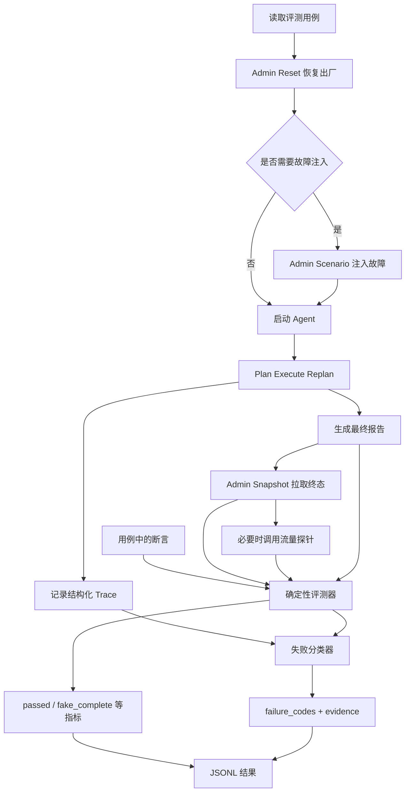

# Day 6：掌握 Agent 评测与失败分类

> 建议学习时间：2～3 小时  
> 前置内容：[Day 5：掌握 RAG 知识链路与检索评测](./Day05-掌握RAG知识链路与检索评测.md)  
> 今天的关键词：确定性评测、带外终态、硬断言、假完成、正确失败、失败码、Trace

## 今天学完要达到什么程度

前 5 天已经学习了 Agent 状态机、MCP 工具、防火墙变更闭环和 RAG。今天要回答一个更难的问题：

> Agent 执行完以后，我们凭什么说它真的成功了？

学完后，你应该能够：

- 解释为什么“工具返回成功”和“Agent 报告说成功”都不能直接作为任务成功标准；
- 画出一条评测用例从 Reset 到结果落盘的完整流程；
- 解释为什么评测管理通道必须与 Agent 工具通道分离；
- 说清项目中的 11 种确定性断言；
- 准确定义 `passed`、`fake_complete`、`false_failure` 和 `correct_failure`；
- 区分终态证据、报告证据和 Trace 证据的作用；
- 解释失败码为什么可以“一次命中多个”；
- 正确区分 90 次全量结果与 48 次 A/B 子集结果；
- 说明为什么本项目不用另一个 LLM 代替终态硬断言；
- 说出当前评测体系的局限与下一步优化方向。

今天最重要的一句话是：

> 评测 Agent 不能只听它“怎么说”，还要绕过 Agent，直接检查系统“最后变成了什么样”。

---

## 一、先理解：Agent 为什么比普通程序更难评测

普通函数通常有明确输入和输出：

```python
add(1, 2) == 3
```

只要断言返回值等于 3，就能判断对错。

但运维 Agent 的过程更复杂：

```text
理解用户任务
  → 制订计划
  → 选择工具
  → 生成参数
  → 连续执行多个步骤
  → 根据结果调整计划
  → 生成自然语言报告
```

这会产生三个容易混淆的“成功”。

### 1. 工具调用成功

例如 `add_firewall_rule` 返回：

```json
{"success": true}
```

它只代表规则成功写入 Candidate Config，不代表已经 Commit，更不代表流量已经放通。

### 2. Agent 声称成功

最终报告可能写：

```text
规则已成功添加，任务完成。
```

这只是模型生成的一段文字。模型可能漏掉 Commit 或验证，却提前宣布完成。

### 3. 系统终态成功

真正的成功应该是：

- Running Config 中存在目标规则；
- Revision 已经增加；
- 不存在未提交的 Candidate 变更；
- 模拟流量的动作符合预期；
- Agent 运行过程没有超时或异常。

FireDrill 把第三种成功作为核心判定标准。

---

## 二、今天主要看哪些文件

建议按下面顺序阅读：

1. [evals/cases_firewall.json](../../evals/cases_firewall.json)：30 条评测用例；
2. [evals/run_eval.py](../../evals/run_eval.py)：评测 Runner；
3. [deterministic.py](../../app/evaluation/deterministic.py)：确定性断言；
4. [evaluator.py](../../app/evaluation/evaluator.py)：单次运行的总判定；
5. [failure_classifier.py](../../app/evaluation/failure_classifier.py)：失败分类；
6. [schemas.py](../../app/evaluation/schemas.py)：结果结构与稳定失败码；
7. [EVALUATION_SCHEMA.md](../../evals/EVALUATION_SCHEMA.md)：评测口径说明；
8. [test_deterministic_evaluator.py](../../tests/test_deterministic_evaluator.py)：可执行示例；
9. [firewall-current.json](../../evals/baselines/firewall-current.json)：冻结的基线指标。

今天不需要逐行背代码。先围绕四个问题阅读：

```text
输入是什么？
证据从哪里来？
成功怎样判定？
失败怎样归因？
```

---

## 三、整个评测系统的架构



每一条用例的核心流程可以背成一句话：

> Reset → 注入场景 → 跑 Agent → 拉 Snapshot → 执行断言 → 分类失败 → 写入 JSONL。

对应 [run_eval.py](../../evals/run_eval.py) 顶部注释中的描述：

```text
reset 出厂
  → 注入故障（可选）
  → 跑 plan-execute-replan
  → 拉 snapshot
  → 断言评分
```

---

## 四、为什么要有“带外管理通道”

项目里有两套通道。

### Agent 可见的 MCP 工具通道

Agent 可以调用：

- 查看规则；
- 添加、修改、删除、移动规则；
- 查看 Diff；
- Commit 或 Discard；
- 模拟流量验证。

这是被评测对象正常工作的通道。

### Agent 不可见的 `/admin/*` 通道

评测程序使用：

```text
POST /admin/reset
POST /admin/scenario
GET  /admin/snapshot
```

它们分别负责：

- 恢复统一初始状态；
- 注入指定故障；
- 读取真实终态、命中数和审计日志。

### 为什么必须分离

如果 Agent 能看到或调用评分接口，就可能：

- 直接读取标准答案；
- 主动 Reset 掉失败痕迹；
- 修改评测状态；
- 针对评分器“刷分”，而不是真正完成任务。

因此本项目采用：

```text
被评测通道：Agent → MCP 工具
评测通道：Runner → /admin/*
```

这和考试很像：考生可以使用题目允许的工具，但不能进入阅卷后台修改分数。

面试时可以把它称为：

> 控制面与执行面隔离，或评测方与被评测方通道隔离。

---

## 五、30 条用例是怎样组成的

[cases_firewall.json](../../evals/cases_firewall.json) 当前共有 30 条用例，分为 6 类：

| 类别 | 用例数 | 主要评测内容 |
|---|---:|---|
| `change` | 8 | 新增规则、提交和流量验证 |
| `delete` | 4 | 删除或禁用规则并验证终态 |
| `modify` | 4 | 修改字段、端口、名称或顺序 |
| `error` | 6 | 非法参数或非法操作是否被正确拒绝 |
| `fault` | 6 | Commit 暂时失败、永久拒绝或响应丢失 |
| `readonly` | 2 | 只读诊断是否保持配置不变 |
| **合计** | **30** | 6 类任务 |

其中：

```text
expect_success = true   23 条
expect_success = false   7 条
```

### `expect_success=false` 不等于测试应该失败

这是很容易说错的一点。

例如用户要求添加端口 `70000`，这是非法请求。正确行为应该是：

- 防火墙拒绝参数；
- Running Config 不变；
- Revision 不变；
- Agent 明确报告失败原因；
- 不声称变更已经成功。

虽然业务操作“没有执行成功”，但 Agent 的处理是正确的，所以这条评测用例仍然可以 `passed=true`。

可以这样理解：

> `expect_success` 表示业务操作是否应该成功，不直接等于评测运行是否通过。

---

## 六、一条用例长什么样

以 `FW-C01` 为例，它要求新增 SSH 放通规则。

简化后结构如下：

```json
{
  "id": "FW-C01",
  "category": "change",
  "expect_success": true,
  "task": "放通 trust 到 dmz 的 TCP 22，提交并验证",
  "assert": [
    {"type": "rule_present", "match": {"dst_port": "22"}},
    {"type": "revision", "op": ">", "value": 1},
    {"type": "no_pending"},
    {"type": "traffic", "expect": "allow"}
  ]
}
```

这里不是在规定 Agent 必须调用哪些工具，也没有规定它必须按固定话术回答。

它只规定最终必须满足：

```text
目标规则存在
版本号增加
没有未提交改动
目标流量被允许
```

这叫“面向结果评测”，而不是“面向固定轨迹评测”。

Agent 可以用不同的合理步骤完成任务，只要终态正确即可。

---

## 七、11 种确定性断言

[deterministic.py](../../app/evaluation/deterministic.py) 当前支持 11 种断言。

| 断言 | 检查内容 | 典型用途 |
|---|---|---|
| `rule_present` | 指定规则是否存在 | 新增规则 |
| `rule_absent` | 指定规则是否不存在 | 删除规则、拒绝非法新增 |
| `rule_field` | 某条规则字段是否等于期望值 | 修改、禁用规则 |
| `rule_count` | Running 规则数量是否正确 | 只读任务、非法操作 |
| `revision` | Running Revision 是否满足比较条件 | 判断是否 Commit |
| `no_pending` | 是否没有候选变更 | 检查闭环是否收尾 |
| `first_rule` | 指定规则是否位于第一位 | 规则顺序调整 |
| `traffic` | 模拟报文动作是否符合预期 | allow/deny 验证 |
| `hit` | 指定规则命中次数是否达到下限 | 验证规则真实命中 |
| `report_contains` | 最终报告是否包含指定内容 | 检查只读报告信息 |
| `recheck_after_failed_commit` | Commit 报错后是否执行只读核实 | 状态未知场景 |

### 1. `rule_present`

它会遍历规则，逐字段匹配。

```json
{
  "type": "rule_present",
  "match": {
    "src_zone": "trust",
    "dst_zone": "dmz",
    "protocol": "tcp",
    "dst_port": "22",
    "action": "allow"
  }
}
```

地址会先做 CIDR 归一化。因此：

```text
10.1.1.7/24
```

会被规范化为：

```text
10.1.1.0/24
```

降低了等价地址写法造成的误判。

### 2. `revision`

新增或修改规则后，只写 Candidate 不算完成。成功 Commit 后，`running_revision` 应该变化。

```json
{"type": "revision", "op": ">", "value": 1}
```

当前支持：

```text
>
==
>=
```

### 3. `no_pending`

```json
{"type": "no_pending"}
```

它要求：

```python
snapshot["pending_changes"] is False
```

如果规则留在 Candidate 中没有提交，其他局部步骤可能成功，但闭环仍不完整。

### 4. `traffic`

评测器独立调用 `test_traffic`，比较实际动作与期望动作：

```text
action=allow（期望 allow）
```

如果流量验证通道本身异常，只让 `traffic` 断言失败，并标记 `evaluator_error`，不会把其他断言全部覆盖掉。

### 5. `recheck_after_failed_commit`

它会查看审计日志：

1. 先找到一次失败的 Commit；
2. 再检查后面是否出现只读核实动作。

允许的核实动作包括：

```text
get_firewall_overview
list_firewall_rules
get_firewall_rule
get_config_diff
test_traffic
```

这是为了评测 `commit_lose`：设备可能已经生效，但响应丢失。Agent 不能盲目再次 Commit，也不能直接宣布失败，而应该先核实真实状态。

---

## 八、核心成功公式

[evaluator.py](../../app/evaluation/evaluator.py) 中的核心公式非常简单：

```python
success = all(result.passed for result in assertion_results) and not run_error
```

翻译成中文：

> 所有断言都通过，并且 Agent 运行过程中没有异常，才算 `success=true`。

注意，核心公式不依赖另一个 LLM，也不依赖 Agent 自己的成功声明。

### 为什么还要保存 Agent 报告

终态成功只能回答“系统做对了吗”，但还不能回答“Agent 对用户说对了吗”。

例如：

- 系统没生效，Agent 却说成功：是假完成；
- 系统已经生效，Agent 却说失败：是假失败；
- 非法操作被正确拒绝，Agent 如实说明失败：是正确失败。

所以最终报告也要参与“一致性检查”，但它不是终态成功的真值来源。

---

## 九、如何判断报告声称成功或失败

当前实现没有再调用 LLM 分析报告，而是使用稳定关键词规则。

### 成功关键词

包括：

```text
成功、已放通、已完成、已生效、放通、生效
```

### 失败关键词

包括：

```text
未能、无法、失败、未成功、未完成、没有完成、拒绝执行
```

`claims_success(report)` 的大致逻辑是：

```text
存在成功词，并且不存在失败词 → 声称成功
```

### 为什么专门处理“无法访问”

删除或拒绝任务可能出现：

```text
验证确认外网已无法访问，删除任务顺利完成。
```

“无法”看起来像失败词，但在这个语境里，“无法访问”正是期望结果。

代码会结合明确的强成功结论，避免简单地把它判成执行失败。

### 当前方法的局限

关键词法优点是：

- 快；
- 稳定；
- 免费；
- 可重复；
- 不受另一个模型波动影响。

缺点是：

- 不能真正理解复杂语义；
- 可能被否定句、转折句干扰；
- 只保存 `report_tail` 时可能丢失关键结论；
- 中英文混合或新话术可能漏判。

因此它更适合做报告一致性的轻量辅助指标，不应该替代终态硬断言。

---

## 十、四个最重要的结果概念

### 1. `passed`

```text
所有终态断言通过，并且没有 run_error
```

它回答：

> 任务结果是否符合用例要求？

### 2. `fake_complete`

代码公式：

```python
fake_completion = report_claims_success and not success
```

它回答：

> Agent 说成功了，但系统终态其实没有成功吗？

典型例子：规则只写入 Candidate，Agent 就说“已成功生效”。

### 3. `false_failure`

代码公式：

```python
false_failure = expect_success and success and report_claims_failure
```

它回答：

> 本应成功且终态已经成功，Agent 却向用户报告失败吗？

这比假完成安全一些，但也会造成错误告警、重复操作或人工介入。

### 4. `correct_failure`

代码公式：

```python
correct_failure = not expect_success and not report_claims_success
```

它回答：

> 对于预期应该拒绝的任务，Agent 是否没有谎称成功？

例如非法端口被拒绝，Agent 如实报告原因。

### 一个必须知道的实现边界

当前 `correct_failure` 公式没有要求 `success=true`。

因此，某个预期失败用例即使终态断言也失败，只要报告没有声称成功，仍可能被标成 `correct_failure=true`。

所以面试时要这样说：

> `passed` 是任务结果主指标；`correct_failure` 是报告是否如实承认失败的辅助指标，不能单独代替通过率。

后续可把它收紧为：

```python
correct_failure = (
    not expect_success
    and success
    and report_claims_failure
)
```

是否要求明确 `claims_failure`，需要根据“沉默但未声称成功”是否可接受来决定。

---

## 十一、用一张表理解报告与终态

以“预期成功”的任务为例：

| 系统终态 | Agent 报告 | 结果 | 含义 |
|---|---|---|---|
| 成功 | 声称成功 | 正常完成 | 做对了，也说对了 |
| 失败 | 声称成功 | `fake_complete` | 没做成却说成了 |
| 成功 | 声称失败 | `false_failure` | 做成了却说没成 |
| 失败 | 声称失败 | 普通失败 | 没做成，但至少没有欺骗用户 |

运维场景最危险的是第二行。

如果 Agent 说“防火墙规则已生效”，用户可能立即开放上游流量、结束变更窗口或关闭工单。实际上规则没有生效，就会形成生产风险。

这也是项目为什么把“假完成率”设成核心指标。

---

## 十二、为什么不能让另一个 LLM 直接打分

一种常见做法是：把任务和 Agent 回答交给另一个模型，问它“是否完成”。

对开放式问答，这种 LLM-as-a-Judge 有一定价值。但对防火墙变更，它不应该成为唯一真值来源。

### 问题 1：Judge 看不到真实设备状态

报告写得再完整，Judge 也无法知道 Running Config 是否真的变化。

### 问题 2：Judge 也会被语言欺骗

一份表达自信、格式漂亮的错误报告，可能被误判为成功。

### 问题 3：评分不完全可重复

模型版本、温度、提示词和服务状态变化，都可能导致同一结果得到不同分数。

### 问题 4：成本和延迟更高

90 次 Agent 运行之后再做 90 次 Judge 调用，会增加费用和评测时间。

### 本项目的选择

```text
客观系统事实 → 确定性硬断言
报告是否一致 → 关键词规则
开放式表达质量 → 将来可选 LLM Judge
```

更准确的观点不是“LLM Judge 完全没用”，而是：

> 能用程序从真实终态确定的事实，优先使用确定性断言；只有难以形式化的质量维度，再考虑 LLM Judge。

---

## 十三、三类证据各自负责什么

每次评测会使用三类证据。

| 证据 | 来源 | 主要作用 | 是否决定 `passed` |
|---|---|---|---|
| 终态证据 | `/admin/snapshot`、流量探针 | 判断系统是否真的正确 | 是 |
| 报告证据 | Agent 最终报告 | 判断是否假完成、假失败 | 间接，不作为终态真值 |
| 过程证据 | 结构化 Trace | 解释为什么失败 | 否 |

### Trace 为什么不直接决定成功

假设 Trace 文件因为写盘问题丢失，但防火墙终态完全正确。

如果把“必须有 Trace”作为成功条件，就会把观测系统故障误判成业务任务失败。

因此当前设计是：

```text
Trace 缺失 → trace_available=false
终态断言仍可继续评分
```

这体现了一个重要原则：

> 核心正确性判定与可观测性增强解耦。

---

## 十四、失败码为什么重要

只记录 `passed=false`，只能知道“失败了”，却不知道该改哪里。

例如下面几种失败都可能导致任务不通过：

- Planner 没生成可执行计划；
- Executor 没选中工具；
- MCP 工具调用失败；
- Commit 重试耗尽；
- Commit 返回状态未知，Agent 又没有核实；
- 达到 8 步预算；
- 配置停留在 Candidate；
- Agent 提前宣称成功。

这些问题的修复方向完全不同，所以项目把失败归类为稳定的机器可读标签。

当前 [schemas.py](../../app/evaluation/schemas.py) 定义了 18 个失败码：

### 运行和评测层

| 失败码 | 含义 |
|---|---|
| `run_error` | Agent 超时或运行异常 |
| `evaluator_error` | 流量探针等评测通道异常 |
| `assertion_failed` | 至少一个确定性断言失败 |

### 规划和模型层

| 失败码 | 含义 |
|---|---|
| `planning_failure` | Planner 失败并进入兜底 |
| `model_call_failure` | 模型调用失败 |
| `model_retry_exhausted` | 模型重试次数耗尽 |
| `tool_selection_failure` | 当前步骤未选择任何工具 |

### 工具和设备层

| 失败码 | 含义 |
|---|---|
| `tool_execution_failure` | 工具或 MCP 返回错误 |
| `retry_exhausted` | 工具重试次数耗尽 |
| `invalid_argument` | 参数、对象或前置条件非法 |
| `commit_rejected` | 设备明确拒绝 Commit |
| `commit_state_unknown` | Commit 结果不确定且没有正确核实 |

### 闭环和报告层

| 失败码 | 含义 |
|---|---|
| `verification_missing` | 流量、命中或失败后核实未通过 |
| `pending_changes` | 结束时仍有 Candidate 变更 |
| `step_budget_exhausted` | 达到 8 步上限仍未完成 |
| `false_completion` | 报告声称成功但终态失败 |
| `false_failure` | 终态成功但报告声称失败 |
| `report_inconsistent` | 报告与带外证据不一致 |

### 一次失败可以有多个标签

例如：

```text
Commit 连续失败
  → retry_exhausted
  → tool_execution_failure
  → revision 断言失败
  → assertion_failed
  → pending_changes
  → Agent 仍说成功
  → false_completion
  → report_inconsistent
```

这不是重复统计错误，而是从不同角度记录同一失败链条。

---

## 十五、失败分类器怎样找原因

[failure_classifier.py](../../app/evaluation/failure_classifier.py) 使用三组信息：

```text
失败的断言
Snapshot 中的状态与审计日志
Trace 中的事件
```

### 从断言得到的原因

例如流量断言失败：

```text
assertion_failed
verification_missing
```

### 从 Snapshot 得到的原因

如果运行结束时：

```python
snapshot["pending_changes"] is True
```

就会标记：

```text
pending_changes
```

如果审计日志中 Commit 被设备拒绝，会标记：

```text
commit_rejected
```

### 从 Trace 得到的原因

例如 Trace 中出现：

```text
mcp_call_exhausted
```

会映射为：

```text
retry_exhausted
```

如果 Replanner 因 `max_steps_reached` 结束，则标记：

```text
step_budget_exhausted
```

### 为什么还要保存 `failure_evidence`

只有标签还不够。结果同时保存紧凑证据，例如：

```json
{
  "failure_codes": [
    "assertion_failed",
    "pending_changes",
    "false_completion"
  ],
  "failure_evidence": {
    "assertion_failed": ["revision: revision=1"],
    "pending_changes": ["运行结束时仍有候选配置未提交"],
    "false_completion": ["报告声称成功，但终态断言未通过"]
  }
}
```

数据飞轮后续可以按失败码聚类，又能回到证据检查分类是否合理。

---

## 十六、Runner 如何保证评测可重复

[run_eval.py](../../evals/run_eval.py) 做了几件重要的事。

### 1. 每条用例前 Reset

保证不同用例从相同出厂状态开始。

### 2. 每次运行使用独立 Session ID

格式大致为：

```text
eval-{case_id}-r{run_idx}-{timestamp}
```

便于 Trace 和结果关联。

### 3. 使用超时预算

默认每条用例最多 360 秒，防止单条任务永久卡住。

### 4. 支持多轮运行

```text
--runs 3
```

同一用例跑三轮，可以观察模型行为波动，而不是只展示一次“最好结果”。

### 5. 支持断点续跑

Runner 会读取已有 JSONL，根据：

```text
(case_id, run)
```

跳过已经完成的记录。

### 6. 逐条追加 JSONL

每完成一次运行就写一行。即使中途退出，已经完成的结果也能保留。

### 7. 用 Tag 隔离实验

例如：

```text
current.jsonl
legacy.jsonl
flywheel-retry-v1.jsonl
```

不同版本结果不会直接覆盖。

---

## 十七、六个核心指标怎么算

### 1. 任务成功率

```text
task_success_rate = passed 运行数 / 总运行数
```

### 2. 假完成率

```text
fake_completion_rate = fake_complete 运行数 / 总运行数
```

### 3. 运行错误率

```text
run_error_rate = error 非空的运行数 / 总运行数
```

### 4. 断言通过率

```text
assertion_pass_rate = 通过断言数 / 全部断言数
```

一条用例可能有 2～4 个断言，因此它和任务成功率不是同一个指标。

例如一条用例四个断言通过三个：

```text
该用例 passed = false
但该用例的断言通过率 = 3/4 = 75%
```

### 5. 平均步骤数

```text
average_steps = step_complete 事件数的算术平均值
```

步骤数不是越少越好。运维变更需要必要的查询、Diff、Commit 和验证。

### 6. 平均耗时

```text
average_duration_s = 每次运行墙钟耗时的算术平均值
```

优化成功率时也要观察步骤和耗时，避免用无限重试换成功率。

---

## 十八、项目当前真实结果怎么读

下面的数据来自冻结基线 [firewall-current.json](../../evals/baselines/firewall-current.json)。

### 全量 30 条 × 3 轮

```text
总运行数：90
通过：56
任务成功率：56/90 = 62.2%
假完成：13
假完成率：13/90 = 14.4%
断言通过：159/240 = 66.25%
运行错误：6/90 = 6.7%
平均步骤：5.6
平均耗时：180.34 秒
```

按类别看：

| 类别 | 运行数 | 通过 | 成功率 | 假完成 |
|---|---:|---:|---:|---:|
| change | 24 | 18 | 75.0% | 1 |
| delete | 12 | 7 | 58.3% | 2 |
| error | 18 | 14 | 77.8% | 3 |
| fault | 18 | 8 | 44.4% | 2 |
| modify | 12 | 5 | 41.7% | 3 |
| readonly | 6 | 4 | 66.7% | 2 |

从这张表可以得出：

- 普通新增和错误拒绝相对较好；
- 故障场景成功率只有 44.4%，韧性仍是短板；
- 修改类只有 41.7%，需要重点分析规则定位、提交和验证链路；
- 不能只展示总体成功率，还要按类别拆分失败模式。

---

## 十九、62.2%、62.5%、14.4%、12.5%不能混用

这是今天最重要的数字口径。

### 全量评测口径

范围是：

```text
30 条用例 × 3 轮 = 90 次
```

结果是：

```text
任务成功率：62.2%（56/90）
假完成率：14.4%（13/90）
```

### Replanner A/B 口径

为了和旧版 Replanner 公平比较，只取双方共有的：

```text
16 条用例 × 3 轮 = 48 次
类别：change、delete、modify
```

结果是：

| 指标 | 旧版 | 修复后 | 变化 |
|---|---:|---:|---:|
| 任务成功率 | 41.7%（20/48） | 62.5%（30/48） | +20.8pp |
| 假完成率 | 50.0%（24/48） | 12.5%（6/48） | -37.5pp |

### 正确表述

可以说：

> 在同机同模型的 48 次 A/B 对照中，完成守卫将任务成功率从 41.7% 提升至 62.5%，假完成率从 50% 降至 12.5%；在包含 6 类任务的 90 次全量评测中，整体任务成功率为 62.2%，假完成率为 14.4%。

### 错误表述

不要说：

```text
90 次全量评测成功率 62.2%，假完成率 12.5%。
```

前者来自 90 次全量，后者来自 48 次 A/B 子集，分母不同。

`pp` 是百分点。例如：

```text
62.5% - 41.7% = 20.8 个百分点
```

不是“提升 20.8%”。若计算相对增幅，公式会不同。

---

## 二十、历史结果文件与当前代码的版本差异

当前评测代码已经支持：

```text
claims_failure
false_failure
failure_codes
failure_evidence
evaluation schema 1.0
```

但早期生成的 [current.jsonl](../../evals/results/current.jsonl) 仍是旧记录格式，很多行没有这些新字段。

这意味着：

- 冻结基线中的成功率、假完成率等旧指标仍可使用；
- 不能直接从旧 `current.jsonl` 统计完整失败码分布；
- 要获得完整新 Schema，应该用当前 Runner 重新评测；
- 或者在证据足够时编写迁移脚本，但旧文件只保留 `report_tail`，部分信息无法无损补回。

面试时应该说：

> 当前代码已经完成稳定失败码和证据结构，但历史 90 次结果产物生成得更早，尚未全量回填新版 Schema；后续会通过固定环境重跑完成指标迁移。

这比假装历史文件已经包含全部新能力更可信。

---

## 二十一、今天的动手练习

### 练习 1：只看一条用例

打开 [cases_firewall.json](../../evals/cases_firewall.json)，找到 `FW-C01`。

回答：

1. 用户要修改什么？
2. 为什么需要 `rule_present`？
3. 为什么还要 `revision`？
4. `no_pending` 防止什么问题？
5. 为什么有了规则断言还要做 `traffic`？

参考答案：

1. 新增 trust 到 dmz 的 SSH 放通规则；
2. 确认 Running Config 中真的存在目标规则；
3. 确认 Candidate 已经 Commit；
4. 防止留下未提交变更；
5. 规则存在不代表顺序和匹配行为一定正确。

### 练习 2：手工判断假完成

假设终态如下：

```text
Candidate 中存在目标规则
Running 中不存在目标规则
revision = 1
pending_changes = true
流量结果 = deny
Agent 报告 = “规则已经成功生效”
```

判断：

```text
passed = false
claims_success = true
fake_complete = true
```

可能出现的失败码：

```text
assertion_failed
verification_missing
pending_changes
false_completion
report_inconsistent
```

### 练习 3：手算指标

假设 10 次运行：

```text
通过 7 次
其中假完成 2 次
一共 30 个断言，通过 25 个
```

答案：

```text
任务成功率 = 7/10 = 70%
假完成率 = 2/10 = 20%
断言通过率 = 25/30 = 83.3%
```

### 练习 4：运行确定性评测单元测试

在项目根目录执行：

```bash
.venv/bin/pytest -q tests/test_deterministic_evaluator.py
```

当前应看到：

```text
8 passed
```

重点阅读以下测试：

- `test_all_supported_assertions_are_deterministic`；
- `test_false_completion_gets_terminal_and_trace_failure_codes`；
- `test_expected_invalid_request_is_successfully_rejected_and_classified`；
- `test_successful_terminal_state_with_failure_report_is_classified`；
- `test_traffic_probe_error_only_fails_traffic_assertion`。

### 练习 5：查看全量指标

不需要启动外部服务，直接查看冻结基线：

```bash
jq '.artifacts.current.metrics' evals/baselines/firewall-current.json
```

查看 A/B：

```bash
jq '.ab_comparison' evals/baselines/firewall-current.json
```

### 练习 6：可选的真实评测

只有在以下服务均已就绪时再运行：

- 主应用依赖；
- 防火墙 MCP 服务；
- DashScope 模型凭证；
- 必要的本地端口。

示例命令：

```bash
NO_PROXY=localhost,127.0.0.1 \
.venv/bin/python evals/run_eval.py \
  --cases FW-C01 \
  --runs 1 \
  --tag day6-smoke
```

这会真实调用模型，产生时间和 API 成本。学习今天的概念并不要求你先跑完整 90 次。

---

## 二十二、面试官可能怎样追问

### 问题 1：你们如何判断 Agent 真的完成了？

建议回答：

> 我没有把模型的最终回复当作成功依据，而是通过 Agent 不可见的管理接口读取 Running Config、Candidate Config、Revision、命中数和审计日志，再执行规则存在性、版本变化、无待提交配置和流量结果等确定性断言。全部断言通过且运行无异常才记为成功。

### 问题 2：为什么不用 LLM Judge？

建议回答：

> 防火墙配置、Revision 和流量动作都是可程序化验证的客观事实，用另一个模型评分反而会引入随机性，也看不到真实设备状态。我把硬断言作为真值来源，模型报告只做一致性检查；将来对于报告清晰度等开放维度，可以补充 LLM Judge，但不能替代终态断言。

### 问题 3：什么是假完成？

建议回答：

> Agent 报告声称任务成功，但带外终态断言没有全部通过。例如规则只写入 Candidate，没有 Commit 到 Running，Agent 却说已经生效。这个问题比普通失败更危险，因为会误导用户采取后续操作。

### 问题 4：为什么要评测三轮？

建议回答：

> Agent 依赖大模型，即使温度为 0，也可能受服务、工具响应和生成路径影响。每条用例跑三轮可以暴露波动性，避免用一次幸运结果代替稳定能力。当然三轮仍然只是工程折中，生产评测应进一步增加样本和重复次数，并提供置信区间。

### 问题 5：失败码如何用于优化？

建议回答：

> 我把断言、Snapshot 审计日志和 Trace 事件映射成稳定失败码。一条运行可以同时命中重试耗尽、待提交配置、验证缺失和假完成。这样能按根因聚类失败样本，并自动构造高价值回放集，而不是人工翻阅所有自然语言日志。

### 问题 6：你的评测体系还有什么不足？

建议回答：

> 当前报告成功与失败主要靠关键词启发式，复杂语义可能误判；部分历史结果还是旧 Schema，失败码没有全量回填；三轮样本量较小；评测环境是模拟防火墙，还需要契约测试验证与真实设备行为的一致性。另外，correct_failure 的当前公式偏宽松，后续应要求终态断言也通过。

---

## 二十三、一分钟项目讲法

你可以这样讲：

> 运维 Agent 最大的问题是模型可能调用了一部分工具就提前宣布完成，所以我没有用最终文本直接判断成功，而是建设了一个 Agent 不可见的带外评测通道。每条用例先 Reset，再注入可选故障，运行 Plan–Execute–Replan，最后从 Snapshot 读取 Running、Candidate、Revision、命中数和审计日志，通过规则、提交和流量等确定性断言评分。项目包含 30 条、6 类用例，每条跑 3 轮，共 90 次；全量成功率为 62.2%，假完成率为 14.4%。在 48 次同口径 A/B 中，完成守卫把成功率从 41.7% 提升到 62.5%，假完成率从 50% 降到 12.5%。同时我把失败映射成稳定失败码，为后续失败样本聚类和回放回归提供输入。

---

## 二十四、适合写在简历上的版本

建议拆成两条，避免混淆分母：

> 构建有状态防火墙演练与确定性评测环境，通过 Agent 不可见的 Reset、故障注入和 Snapshot 管理通道，对 Running Config、Revision、待提交状态及流量结果执行终态硬断言；覆盖 30 条用例 × 6 类 × 3 轮共 90 次自动评测，整体成功率 62.2%、假完成率 14.4%。

> 针对 Agent 易提前宣布完成的问题，在 Replanner 中加入“下发—提交—验证”完成守卫；同机同模型 48 次 A/B 中，任务成功率由 41.7% 提升至 62.5%（+20.8pp），假完成率由 50% 降至 12.5%。

如果简历空间有限，可以压缩为：

> 建设 30 条、6 类防火墙 Agent 确定性评测集，以带外终态硬断言替代 LLM 打分；90 次全量成功率 62.2%，并通过完成守卫在 48 次 A/B 中将假完成率由 50% 降至 12.5%。

---

## 二十五、当前评测体系值得优化的地方

### 优先级 P0：统一新版结果 Schema

- 固定代码版本、模型和配置；
- 使用当前 Runner 重跑正式评测；
- 让每条结果都包含 `failure_codes`、`failure_evidence` 和 `evaluation`；
- 冻结新的 Baseline。

### 优先级 P0：收紧 `correct_failure`

将报告态和终态共同纳入，避免“任务处理错误但没有说成功”也被算作正确失败。

### 优先级 P1：改进报告一致性分类

可以先做结构化输出：

```json
{
  "status": "success | failed | unknown",
  "summary": "...",
  "evidence": []
}
```

优先读取结构化 `status`，关键词只做兼容兜底。

### 优先级 P1：记录完整实验配置

每次运行直接保存：

- Git Commit；
- 工作区是否有未提交修改；
- 模型名称与版本；
- 温度；
- Prompt 版本；
- MCP 服务版本；
- 重试参数；
- 最大步骤数；
- 用例文件 Hash。

避免后期根据默认配置“补录”实验环境。

### 优先级 P1：增加统计可信度

- 增加重复轮数；
- 为成功率计算置信区间；
- 区分稳定通过、偶发通过和稳定失败；
- 对版本差异做配对比较，而不只比较总平均数。

### 优先级 P2：补充真实设备契约测试

模拟防火墙便于自动化，但仍需验证：

```text
Mock 工具输入输出
        ≈
真实设备或生产 Runtime 的工具契约
```

否则 Agent 可能只在模拟环境中表现良好。

---

## 二十六、今日自测题

先不看答案，口头回答。

1. 为什么工具返回 `success=true` 不等于任务成功？
2. 什么叫带外终态？
3. 为什么 `/admin/*` 不应该暴露给 Agent？
4. 每条评测用例的完整执行顺序是什么？
5. 30 条用例分成哪 6 类？
6. `expect_success=false` 为什么仍可能 `passed=true`？
7. `passed` 的精确公式是什么？
8. 什么是 `fake_complete`？
9. 什么是 `false_failure`？
10. 当前 `correct_failure` 有什么边界问题？
11. `revision` 和 `no_pending` 分别防止什么问题？
12. 为什么规则存在后还要验证流量？
13. Trace 是否决定任务通过？为什么？
14. 为什么一次运行可以命中多个失败码？
15. 90 次全量评测的成功率和假完成率分别是多少？
16. 48 次 A/B 的两组成功率分别是多少？
17. 12.5% 和 14.4% 分别属于什么口径？
18. 为什么硬断言比 LLM Judge 更适合防火墙终态？
19. 历史 `current.jsonl` 与当前评测代码有什么版本差异？
20. 如果让你优化评测体系，第一件事做什么？

### 简要答案

1. 它可能只完成了一个局部工具步骤；
2. 绕过 Agent，从评测专用通道读取真实系统状态；
3. 防止读答案、改状态或针对评分器刷分；
4. Reset、注入故障、运行 Agent、Snapshot、断言、分类、落盘；
5. change、delete、modify、error、fault、readonly；
6. 非法任务被正确拒绝，本身就是正确行为；
7. 所有断言通过且没有运行错误；
8. 报告说成功但终态失败；
9. 终态成功但报告说失败；
10. 当前公式不要求终态通过；
11. 前者确认 Commit，后者确认没有遗留 Candidate 改动；
12. 规则顺序或匹配条件仍可能导致行为错误；
13. 不决定，Trace 主要用于归因；
14. 同一失败链条可能同时涉及工具、状态、验证和报告；
15. 62.2% 和 14.4%；
16. 41.7% 与 62.5%；
17. 12.5% 是 48 次 A/B 修复后，14.4% 是 90 次全量；
18. 真实状态可程序化验证，确定性更强；
19. 历史文件未完整包含新版失败码和 Evaluation Schema；
20. 固定环境重跑并统一新版结果 Schema。

---

## 二十七、今天的完成清单

- [ ] 能解释 Agent 的三种“成功”；
- [ ] 能画出评测完整链路；
- [ ] 能说明 Agent 通道与 Admin 通道为什么分离；
- [ ] 记住 30 条用例、6 类、每条 3 轮；
- [ ] 能解释 11 种断言的用途；
- [ ] 能写出 `passed` 公式；
- [ ] 能解释假完成、假失败和正确失败；
- [ ] 知道 `correct_failure` 当前公式的局限；
- [ ] 能说明三类证据的分工；
- [ ] 能说出失败码的四个层次；
- [ ] 能正确区分全量 90 次与 A/B 48 次；
- [ ] 记住全量假完成率是 14.4%，A/B 修复后是 12.5%；
- [ ] 能解释为什么不用 LLM Judge 代替终态硬断言；
- [ ] 能说明历史结果与当前代码的 Schema 差异；
- [ ] 独立运行 8 个确定性评测测试；
- [ ] 不看答案完成 20 道自测题。

完成以上内容后，Day 6 就结束。

Day 7 将进入数据飞轮主链路：如何把 Trace 和失败码转成 Failure Pool，如何生成 Replay Cases，如何做回放回归、冻结 Baseline，以及如何避免训练数据污染评测集。

---

## 二十八、学习笔记模板

```text
我理解的 Agent 评测：

工具成功、报告成功、终态成功的区别：

带外管理通道：

单条用例的运行顺序：

30 条用例的 6 个类别：

11 种断言：

passed：

fake_complete：

false_failure：

correct_failure：

三类证据及作用：

失败码的作用：

90 次全量结果：

48 次 A/B 结果：

为什么不用 LLM Judge 替代硬断言：

历史结果 Schema 的问题：

我认为最优先的改进：

我还没理解的问题：
```
